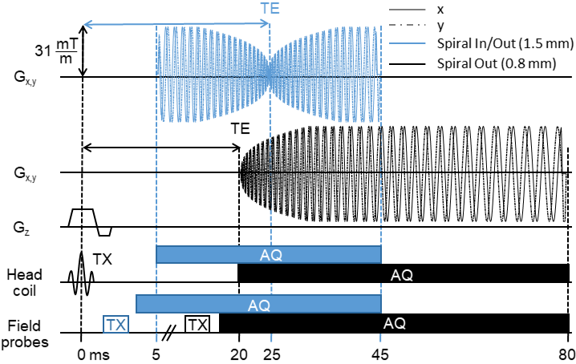
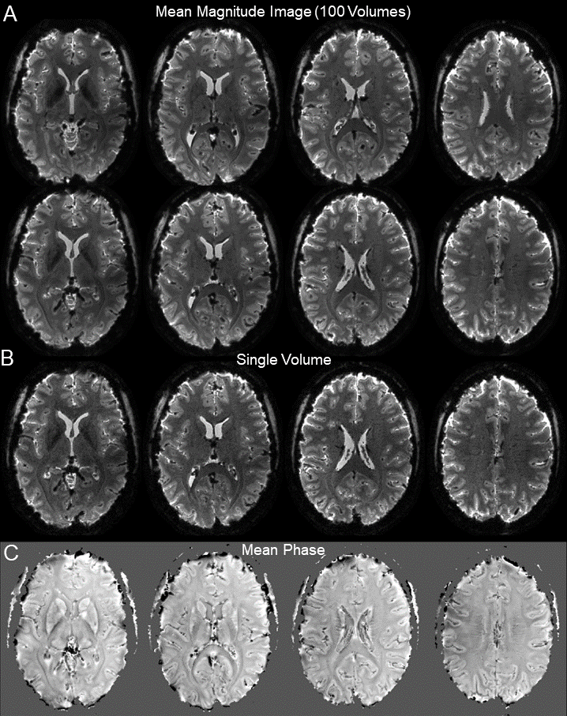
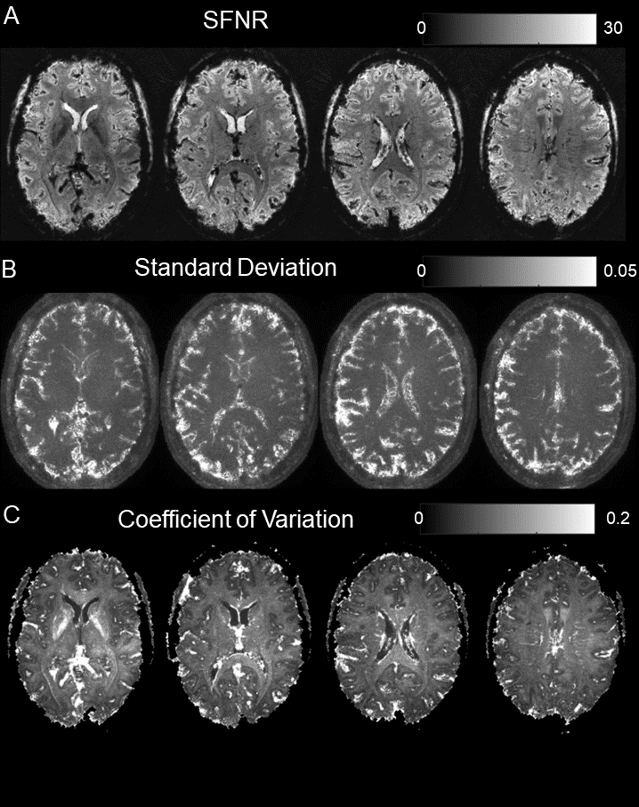
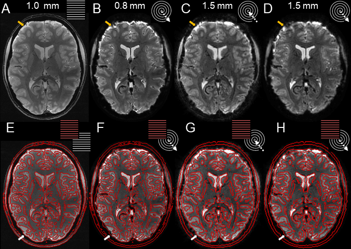
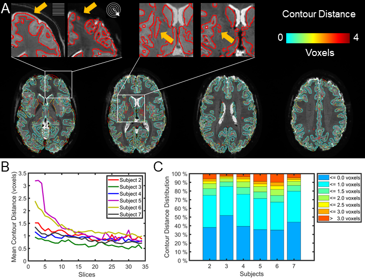
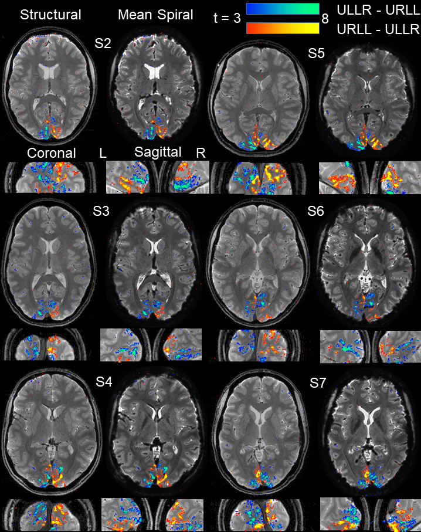

Advances in Spiral fMRI: A High-resolution Study with Single-shot Acquisition
=============================================================================

Lars Kasper (1,2), Maria Engel (1), Jakob Heinzle (2), Matthias
Mueller-Schrader (2), Nadine N. Graedel (1,3), Jonas Reber (1), Thomas Schmid 
(1), Christoph Barmet (1), Bertram J.Wilm (1), Klaas Enno Stephan (2,4,5), Klaas
Paul Pruessmann (1)

1.  Institute for Biomedical Engineering, ETH Zurich and University of Zurich,
    Gloriastrasse 35, 8092 Zurich, Switzerland
2.  Translational Neuromodeling Unit, Institute for Biomedical Engineering,
    University of Zurich and ETH Zurich, Wilfriedstrasse 6, 8032 Zurich,
    Switzerland
3.  Wellcome Centre for Integrative Neuroimaging, FMRIB, Nuffield Department of
    Clinical Neurosciences, University of Oxford, Oxford, United Kingdom
4.  Wellcome Centre for Human Neuroimaging, University College London, London
    WC1N 3BG, UK
5.  Max Planck Institute for Metabolism Research, 50931 Cologne, Germany

Highlights
==========

-   This work reports the first fMRI study at 7T with spiral readout gradient
    waveforms.

-   We achieve spiral fMRI with sub-millimeter resolution (0.8 mm, in-plane FOV
    230 mm), acquired in a single shot.

-   Spiral images exhibit intrinsic geometric congruency to anatomical scans,
    and spatially highly specific activation patterns.

-   Image reconstruction rests on a signal model expanded by measured
    trajectories and static field maps, inverted by cg-SENSE.

-   We assess generalizability of the approach for spiral in/out readouts,
    providing two images per shot (1.5 mm resolution).

Abstract
========

Spiral fMRI has been put forward as a viable alternative to rectilinear
echo-planar imaging, in particular due to its enhanced average k-space speed and
thus high acquisition efficiency. This renders spirals attractive for
contemporary fMRI applications that require high spatiotemporal resolution, such
as laminar or columnar fMRI. However, in practice, spiral fMRI is typically
hampered by its reduced robustness and ensuing blurring artifacts, which arise
from imperfections in both static and dynamic magnetic fields.

Recently, these limitations have been overcome by the concerted application of
an expanded signal model that accounts for such field imperfections, and its
inversion by iterative image reconstruction. In the challenging ultra-high field
environment of 7 Tesla, where field inhomogeneity effects are aggravated, both
multi-shot and single-shot 2D spiral imaging at sub-millimeter resolution was
demonstrated with high depiction quality and anatomical congruency.

In this work, we further these advances towards a time series application of
spiral readouts, namely, single-shot spiral BOLD fMRI at 0.8 mm in-plane
resolution. We demonstrate that spiral fMRI at 7 T is not only feasible, but
delivers both competitive image quality and BOLD sensitivity, with a spatial
specificity of the activation maps that is not compromised by artifactual
blurring. Furthermore, we show the versatility of the approach with a combined
in/out spiral readout at a more typical resolution (1.5 mm), where the high
acquisition efficiency allows to acquire two images per shot for improved
sensitivity by echo combination.

Introduction
============

Functional MRI (fMRI) is presently the most prominent technique to study human
brain function non-invasively, owing to its favorable spatiotemporal resolution
regime with appealing functional sensitivity. Within this regime, specific
research questions require different trade-offs between spatial and temporal
resolution. On the one hand, ultra-high spatial resolution fMRI at
sub-millimeter voxel size successfully targets smaller organizational structures
of the brain, such as cortical laminae (Fracasso et al., 2016; Huber et al.,
2017a; Kashyap et al., 2018; Kok et al., 2016; Lawrence et al., 2018; Martino et
al., 2015; Muckli et al., 2015; Siero et al., 2011) and columns (Cheng et al.,
2001; Feinberg et al., 2018; Yacoub et al., 2008), or subcortical nuclei, but
requires compromises on coverage (FOV) or temporal bandwidth, i.e., volume
repetition time (TR). On the other hand, fast sequences with TRs on the order of
0.5 seconds and below are important for advanced analysis approaches, e.g., to
adequately sample physiological fluctuations (Lewis et al., 2016; Smith et al.,
2013; Uğurbil et al., 2013), at the expense of lowering spatial resolution
(2–4 mm).

One means to simultaneously advance the spatial and temporal resolution
boundaries of fMRI is to maximize acquisition efficiency, i.e., sampled k-space
area (or volume) per unit time. Therefore, fMRI nowadays almost exclusively
relies on rectilinear echo-planar imaging (EPI, (Cohen and Schmitt, 2012;
Mansfield, 1977; Schmitt et al., 2012)), where acquisition efficiency is
favorable due to optimal acceleration and high terminal velocity along the
straight k-space lines traversed.

To expand spatiotemporal resolution beyond the capabilities of EPI alone, the
main strategy has been parallel imaging acceleration (Griswold et al., 2002;
Pruessmann et al., 1999), in combination with simultaneous multi-slice or 3D
excitation (Breuer et al., 2006; Larkman et al., 2001; Poser et al., 2010;
Setsompop et al., 2012). In terms of k-space coverage per unit time, the benefit
of parallel imaging lies in expanding the cross section of what is effectively a
tube of k-space covered along the readout trajectory (Pruessmann, 2006).

By focusing efforts on maximizing acquisition efficiency in this way, another
key determinant of the speed of coverage was less emphasized, which is the
average velocity along the trajectory, i.e., the average instantaneous gradient
strength. On this count, EPI is wasteful because it includes many sharp turns
that must be traversed at low speed because of limited gradient slew rate.

It has long been recognized, also in the context of fMRI (Barth et al., 1999;
Glover, 2012; Noll et al., 1995), that substantially higher average k-space
speed and thus acquisition efficiency is achieved with spiral trajectories,
which avoid sharp turns by distributing curvature more evenly (Ahn et al., 1986;
Likes, 1981; Meyer et al., 1992). Typically, single-shot variants winding out of
k-space center, e.g., on an Archimedean spiral, are prevalent (Glover, 1999;
Meyer et al., 1992), but different acquisition schemes, such as spiral-in
(Börnert et al., 2000) or combined in/out readouts (Glover and Law, 2001; Glover
and Thomason, 2004) have been proposed. High resolution fMRI studies have
occasionally employed spirals as well (Jung et al., 2013; Singh et al., 2018),
albeit reducing acquisition efficiency in favor of robustness by acquiring
k-space in multiple shots with shorter spiral readouts.

However, routine use of spiral fMRI has not been established, due to the
following three challenges (Block and Frahm, 2005; Börnert et al., 1999): First,
spirals are sensitive to imperfect magnetic field dynamics (eddy currents and
other gradient imperfections, as well as subject-induced field changes, e.g.,
via breathing) which lead to blurring and image distortions. Secondly,
non-uniformity of the static B0 field, caused by varying susceptibility of the
imaged tissues, likewise causes blurring. Finally, in combination with parallel
imaging, spirals pose a somewhat greater reconstruction challenge than Cartesian
trajectories (Pruessmann et al., 2001).

Recently, these obstacles have been overcome (Engel et al., 2018b; Kasper et
al., 2018; Wilm et al., 2017) by (1) employing an expanded signal model that
accounts for the actual static and dynamic fields as well as coil sensitivity
encoding (Wilm et al., 2011), and (2) the inversion of this model by an
accompanying iterative image reconstruction (Barmet et al., 2005; Man et al.,
1997; Pruessmann et al., 2001; Sutton et al., 2003). This approach enabled the
use of very long spiral readouts (on the order of 50 ms at 7 Tesla), while
maintaining competitive image quality and anatomical fidelity. In particular,
such enhanced spiral acquisition efficiency was demonstrated by accomplishing
T2\*-weighted images with an in-plane resolution of 0.8 mm in a single shot.
Ultimately, these findings hold promise that spiral fMRI can now indeed profit
from the theoretical advantages of enhanced acquisition efficiency to expand the
spatiotemporal boundaries of fMRI.

Based on these advances in expanded signal modeling and inversion, in this work,
we explore the feasibility and utility of sub-millimeter single-shot spiral
fMRI. Specifically, we first assess image quality and temporal stability of fMRI
time series obtained with the expanded signal model and algebraic
reconstruction. We further evaluate the resulting functional sensitivity, using
an established visual quarter-field stimulation to elicit reference activation
patterns and demonstrate spatial specificity and geometric consistency of the
resulting activation at the level of the nominal resolution (0.8 mm). Finally,
we explore the versatility of the approach with a combined in/out spiral readout
at a more typical resolution (1.5 mm). Here, two images per shot can be
acquired, translating the high acquisition efficiency of the spiral into
enhanced functional sensitivity by echo combination (Glover and Law, 2001;
Glover and Thomason, 2004; Law and Glover, 2009).

Methods
=======

Setup
-----

All data was acquired on a Philips Achieva 7 Tesla MR System (Philips
Healthcare, Best, The Netherlands), with a quadrature transmit coil and
32-channel head receive array (Nova Medical, Wilmington, MA).

Concurrent magnetic field monitoring was performed using 16 fluorine-based NMR
field probes, which were integrated into the head setup via a laser-sintered
nylon frame positioned between transmit and receive coil (Engel et al., 2018b,
Fig. 1). Probe data were recorded and preprocessed (filtering, demodulation) on
a dedicated acquisition system (Dietrich et al., 2016a). The final extraction of
probe phase evolution and projection onto a spherical harmonic basis set (Barmet
et al., 2008) was performed on a PC, yielding readout time courses of global
phase $$k_{0}$$ and k-space coefficients $$k_{x},k_{y},k_{z}$$ with 1 MHz
bandwidth.

For the fMRI experiments, visual stimulus presentation utilized VisuaStim LCD
goggles (Resonance Technology Inc., Northridge, CA, USA). A vendor-specific
respiratory bellows and finger pulse plethysmograph recorded subject physiology,
i.e., respiratory and cardiac cycle.

fMRI Paradigm and Subjects
--------------------------

Seven healthy subjects (4 female, mean age 25.7 +/- 4.1 y) took part in this
study, after written informed consent and with approval of the local ethics
committee. One subject was excluded from further analysis due to reduced signal
in multiple channels of the head receive array. Thus, six subjects were analyzed
for this study.

The paradigm, a modified version of the one used in (Kasper et al., 2014),
comprised two blocks of 15 s duration that presented flickering checkerboard
wedges in complementary pairs of the visual quarter-fields. In one block,
*u*pper *l*eft and *l*ower *r*ight visual field were stimulated simultaneously
(condition ULLR), while the other block presented the wedges in the *u*pper
*r*ight and *l*ower *l*eft quarter-fields (condition URLL). These stimulation
blocks were interleaved with equally long fixation periods. To keep subjects
engaged, they had to respond to slight contrast changes in the central fixation
cross via button presses of the right hand. A single run of the paradigm took 5
min (5 repetitions of the ULLR-Fixation-URLL-Fixation sequence).

Spiral Trajectories and Sequence Timing
---------------------------------------

Spiral fMRI was based on a slice-selective multi-slice 2D gradient echo sequence
(Fig. 1) with custom-designed spiral readout gradient waveforms. For every third
slice, concurrent field recordings were performed on the dedicated acquisition
system (Dietrich et al., 2016a), with NMR field probes being excited a few
milliseconds prior to readout gradient onset (Fig. 1, bottom row, (Engel et al.,
2018b)).

For the spiral trajectories, we selected two variants that had previously
provided high-quality images in individual frames (Engel et al., 2018b, Fig. 2):
a high-resolution case winding out of k-space center on an Archimedean spiral
(spiral-out, Fig. 1, black gradient waveform), and a combined dual-image readout
first spiraling into k-space center, immediately followed by a point-symmetric
outward spiral (spiral in/out (Glover and Law, 2001)), Fig. 1, blue gradient
waveform).

The spiral-out gradient waveform was designed to deliver the highest spatial
resolution possible under several constraints. First, targeting maximum
acquisition efficiency in 2D commands a single-shot 2D readout, because the
sequence overhead, i.e., time spent without sampling k-space, accrues for each
new excitation. Second, the parallel imaging capability of our receiver array at
7 T allowed for an in-plane acceleration factor of R=4 (determining the spacing
of the spiral revolutions, i.e., FOV). We based this choice on previous
experience with spirals of such undersampling using this setup (Engel et al.,
2018b; Kasper et al., 2018), which were free of aliasing artifacts or
disproportional noise amplification. Third, the requirement of concurrent field
recordings for the whole spiral readout limited its maximum duration to below 60
ms. This is the approximate lifetime of the NMR field probe signal, after which
complete dephasing occurs in a subset of probes for this specific setup,
governed by their T2\* decay time of 24 ms (Engel et al., 2018b). Finally, the
gradient system specifications constrain the maximum possible resolution (or
k-space excursion) of an Archimedean spiral with prescribed FOV and duration.
Here, we used the optimal control algorithm by (Lustig et al., 2008) to design
time-optimal spiral gradient waveforms of 31 mT/m maximum available gradient
amplitude, and a 160 mT/m/ms slew rate limit, chosen for reduced peripheral
nerve stimulation.

Overall, these requirements led to a spiral-out trajectory with a nominal
in-plane resolution of 0.8 mm (for a FOV of 230 mm), at a total readout
acquisition time (TAQ) of 57 ms. BOLD-weighting was accomplished by shifting the
readout start, i.e., TE, to 20 ms.

For the spiral in/out, we followed the same design principles, targeting a
minimum dead time after excitation, and a symmetric readout centered on a TE of
25 ms, slightly shorter than reported T2\* values in cortex at 7 T (Peters et
al., 2007). This resulted in a gradient waveform lasting 39 ms, with a nominal
resolution of 1.5 mm for each half-shot of the trajectory.

All other parameters of both spiral sequences were shared, in order to
facilitate comparison of their functional sensitivity. In particular, slice
thickness (0.9 mm) and gap (0.1 mm) were selected for near-isotropic sub-mm
resolution for the spiral-out case, while still covering most of visual cortex.
For each slice, the imaging part of the sequence (Fig. 1) was preceded by a fat
suppression module utilizing Spectral Presaturation with Inversion Recovery
(SPIR, (Kaldoudi et al., 1993)).

The sequence duration totaled 90 ms per slice for the spiral-out sequence (TE
20 ms + TAQ 60 ms + SPIR 10 ms), which was maintained for the spiral in/out,
even though a shorter imaging module would have been possible. To arrive at a
typical volume repetition time for fMRI, we chose to acquire 36 slices (TR
3.3 s). Each functional run comprised 100 volume repetitions, amounting to a
scan duration of 5.5 min.

Image Reconstruction
--------------------

Image reconstruction rested on an expanded model of the coil signal
$$s_{\gamma}$$ (Wilm et al., 2011), that – besides transverse magnetization
$$m$$ – incorporates coil sensitivity $$c_{\gamma}$$, as well as phase accrual
by both magnetostatic B0 field inhomogeneity (offresonance frequency
$$\Delta\omega_{0}$$) (Barmet et al., 2005) and magnetic field dynamics
$$k_{l}$$ expanded in different spatial basis functions $$b_{l}$$ (Barmet et
al., 2008):

|   | s_{\\gamma}\\left( t \\right) = \\int_{V}\^{}{c_{\\gamma}\\left( \\mathbf{r} \\right) \\cdot m\\left( \\mathbf{r} \\right) \\cdot e\^{i\\sum_{l}\^{}{k_{l}\\left( t \\right)b_{l}\\left( \\mathbf{r} \\right)}} \\cdot e\^{i\\Delta\\omega_{0}(\\mathbf{r})t} \\cdot \\text{dV}} |   |
|---|----------------------------------------------------------------------------------------------------------------------------------------------------------------------------------------------------------------------------------------------------------------------------------|---|

with coil index $$\gamma$$, sampling time $$t$$, imaging volume $$V$$, and
location vector $$\mathbf{r} = \left\lbrack \text{x\ y\ z} \right\rbrack^{T}$$.

For 2D spiral imaging without strong higher order eddy currents (e.g., as
induced by diffusion encoding gradients), this model can be computationally
reduced (Engel et al., 2018b) to facilitate iterative inversion. To this end, we
(1) considered only field dynamics contributing to global phase $$k_{0}$$ and
spatially linear phase, i.e., k-space $$\mathbf{k} = \lbrack k_{x}\ k_{y}\
k_{z}\rbrack$$, as provided by the concurrent field recordings, and (2)
restricted the integration to the excited 2D imaging plane by shifting the
coordinate origin to the slice center $$\mathbf{r}_{\mathbf{0}}$$, effectively
factoring slice-orthogonal field dynamics out of the integral:

|   | s_{\\gamma}\\left( t \\right) = \\int_{V}\^{}{c_{\\gamma}\\left( \\mathbf{r} \\right) \\cdot m\\left( \\mathbf{r} \\right) \\cdot e\^{i\\left( k_{0}\\left( t \\right) + \\mathbf{k}\\left( t \\right) \\cdot \\mathbf{r} \\right)} \\cdot e\^{i\\Delta\\omega_{0}\\left( \\mathbf{r} \\right)t} \\cdot \\text{dV} = \\ e\^{i\\left( k_{0}\\left( t \\right) + \\mathbf{k}\\left( t \\right) \\cdot \\mathbf{r}_{\\mathbf{0}} \\right)}\\int_{V}\^{}{c_{\\gamma}\\left( \\mathbf{r} \\right) \\cdot m\\left( \\mathbf{r} \\right) \\cdot e\^{i\\mathbf{k}\\left( t \\right) \\cdot \\left( \\mathbf{r}\\mathbf{-}\\mathbf{r}_{\\mathbf{0}} \\right)} \\cdot e\^{i\\Delta\\omega_{0}\\left( \\mathbf{r} \\right)t} \\cdot \\text{dV}}} |   |
|---|---------------------------------------------------------------------------------------------------------------------------------------------------------------------------------------------------------------------------------------------------------------------------------------------------------------------------------------------------------------------------------------------------------------------------------------------------------------------------------------------------------------------------------------------------------------------------------------------------------------------------------------------------------------------------------------------------------------------------------------|---|

For the demodulated coil signal $$\tilde{s_{\gamma}}\left( t \right) =
s_{\gamma}\left( t \right) \cdot \exp{( - i\left( k_{0}\left( t \right) +
\mathbf{k}\left( t \right) \cdot \mathbf{r}_{\mathbf{0}}\mathbf{)} \right)}$$,
the discretized version of eq. (2) – respecting finite spatial resolution and
dwell time of the acquisition system – reads as a system of linear equations

|   | {\\tilde{s}}_{\\left( \\gamma,\\tau \\right)} = \\sum_{\\rho}\^{}{E_{\\left( \\gamma,\\tau \\right),\\rho}m_{\\rho}} |   |
|---|----------------------------------------------------------------------------------------------------------------------|---|

with sampling time index $$\tau$$, voxel index $$\rho$$, $${\tilde{s}}_{\left(
\gamma,\tau \right)} = {\tilde{s}}_{\gamma}(t_{\tau})$$, encoding matrix element
$$E_{\left( \gamma,\tau \right),\rho} = \ c_{\gamma}\left( \mathbf{r}_{\rho}
\right) \cdot e^{i\mathbf{k}\left( t_{\tau} \right) \cdot
(\mathbf{r}_{\rho}\mathbf{-}\mathbf{r}_{\mathbf{0}}\mathbf{)}} \cdot
e^{i\Delta\omega_{0}\left( \mathbf{r}_{\rho} \right)t_{\tau}}$$, and $$m_{\rho}
= m(\mathbf{r}_{\rho}\mathbf{)}$$**.**

The matrix-vector form of eq. (3) is a general linear model,

|   | \\tilde{\\mathbf{s}} = E\\ \\mathbf{m} |   |
|---|----------------------------------------|---|

and can be efficiently solved iteratively by a conjugate gradient (CG) algorithm
(Pruessmann et al., 2001; Shewchuk, 1994). As mentioned above, the restriction
to first order field dynamics enables acceleration of the ensuing matrix-vector
multiplications by (reverse) gridding and fast Fourier transform (FFT) (Beatty
et al., 2005; Jackson et al., 1991). Offresonance effects can also be
approximated by FFT using multi-frequency interpolation (Man et al., 1997).

This image reconstruction algorithm was applied equivalently to the spiral-out
and spiral in/out data. Note, however, that for the latter both field recordings
and coil data were split into their in- and out-part and reconstructed
separately, yielding two images per shot.

Taken together, the in-house Matlab (The Mathworks, Natick, MA, R2018a)
implementation of this algorithm led to reconstruction times of about 10 min per
slice on a single CPU core. In order to reconstruct the 3600 2D images per fMRI
run, reconstruction was parallelized over slices on the university’s CPU
cluster. Depending on cluster load, reconstructions typically finished over
night for the high-resolution spiral out, and within 2 h for the spiral in/out
data.

The auxiliary input data for the expanded signal model, i.e., spatial maps for
static B0 field inhomogeneity $$\text{Δω}$$ and coil sensitivity $$c_{\gamma}$$,
were derived from a separate fully sampled multi-echo (ME) Cartesian gradient
echo reference scan of 1 mm in-plane resolution, TE1 = 4ms, $$\text{ΔTE}$$ = 1ms
(Kasper et al., 2018), with slice geometry equivalent to the spiral sequences.
Image reconstruction proceeded as described above for this scan, albeit omitting
the sensitivity and static B0 map terms. The latter was justified by the high
bandwidth of the Cartesian spin-warp scans (1 kHz).

Sensitivity maps were then computed from the first-echo image, normalizing
single coil images by the root sum of squares over all channels, while the B0
map was calculated by regressing the pixel-wise phase evolution over echo
images. Both maps were smoothed and slightly extrapolated via a variational
approach (Keeling and Bammer, 2004).

Data Analysis
-------------

### Image Quality Assessment

The suitability of the raw imaging data for high-resolution fMRI was assessed in
terms of both sensitivity and spatial specificity. For sensitivity, we evaluated
the temporal statistics of the images, i.e., signal-to-fluctuation noise ratio
(SFNR), standard deviation (SD) and coefficient of variation (CoV) maps
(Welvaert and Rosseel, 2013), defined as

|   | \\text{CoV} = \\frac{1}{\\text{SFNR}}\\ , |   |
|---|-------------------------------------------|---|

where the bar denotes averaging over volumes of a run.

For spatial specificity, we visually compared the spiral images to the ME
reference scan, which exhibits a high geometric veracity due to its spin-warp
nature, i.e., high bandwidth. We overlaid the contour edges (intensity isolines)
of the mean (over echoes) of the ME images onto the mean spiral images
$$\overset{\overline{}}{m\left( \mathbf{r}_{\rho} \right)}$$ to inspect the
congruency of anatomical boundaries between the scans.

To reduce the impact of subject motion on both assessments, the volumes of the
fMRI time series were first realigned to each other. Then, the mean ME scan was
co-registered to the resulting mean realigned fMRI scan, Importantly, both
operations were limited to six-parameter rigid-body registration, such that
nonlinear geometric distortions between sequences were not corrected through
this preprocessing step. Furthermore, to facilitate visual comparison and
contour edge creation, mean ME and spiral images were bias-field corrected using
unified segmentation (Ashburner and Friston, 2005).

All computations were performed in Matlab R2018b, using the Unified NeuroImaging
Quality Control Toolbox (UniQC, (Bollmann et al., 2018)), and SPM12 (Wellcome
Centre for Human Neuroimaging, London, UK, <http://www.fil.ion.ucl.ac.uk/spm/>).

### BOLD fMRI Analysis

The main goal of this analysis was to establish the functional sensitivity of
the spiral fMRI sequences at the single-subject level under standard paradigm
and preprocessing choices. On a qualitative level, we also assessed the spatial
specificity of functional activation.

Equivalent preprocessing steps were applied to all spiral fMRI runs using SPM12.
After slice-timing correction, we employed the pipeline described in the
previous section (realignment, co-registration, bias-field correction via
unified segmentation). Finally, the functional images were slightly smoothed
with a Gaussian kernel of 0.8mm FWHM, i.e., the voxel size of the
high-resolution scan.

The general linear model (GLM) contained regressors of the two stimulation
blocks (ULLR and URLL) convolved with the hemodynamic response function (HRF),
as well as nuisance regressors for motion (6 rigid-body parameters) and
physiological noise (18 RETROICOR (Glover et al., 2000) regressors, as specified
in (Harvey et al., 2008)), extracted by the PhysIO Toolbox (Kasper et al.,
2017).

To characterize functional sensitivity, we evaluated the differential
t-contrasts +/- (ULLR-URLL) and report results both with and without multiple
comparison correction. For visualization, Figures 5-7 show activations without
correction, at a threshold of p\<0.001 (t\>3.22). This helps to demonstrate the
spatial specificity of activations. By contrast, Table 1 reports activations
under whole-brain family-wise error (FWE) correction at the cluster level
(p\<0.05), with a cluster defining threshold (p\<0.001) that corresponds to the
threshold used for visualization.

Spatial specificity of the activation was qualitatively assessed by overlaying
the thresholded t-contrast maps for both contrasts onto the anatomically
veridical mean ME image. We checked whether activation patterns were restricted
to gray matter regions of visual cortex, as well as whether the spatial
separation and symmetry of activations were linked to distinct quarter-field
stimulation patterns, as expected by the retinotopic organization of visual
cortex (Engel et al., 1997; Wandell et al., 2007; Warnking et al., 2002). On
top, we also evaluated the individual contrasts for the ULLR and URLL
stimulation blocks to assess the spatial overlap of their activation patterns as
an alternative measure of functional specificity (since the differential
contrasts cannot overlap by design).

This overall analysis procedure was performed for the spiral-out as well as the
individual spiral-in and spiral-out image time series reconstructed from the
spiral in/out data. As spiral in/out sequences are predominantly selected for
their potential gain in functional sensitivity when combining spiral-in and
spiral-out images (Glover and Law, 2001), we additionally repeated the BOLD fMRI
analysis for such a surrogate dataset (“in/out combined”). We chose a
signal-weighted combination per voxel (Glover and Thomason, 2004), which is
considered the most practical approach for echo combination (Glover, 2012):

|   | w = \\frac{\\overline{m_{1}}}{\\overline{m_{1}} + \\overline{m_{2}}}\\ , |   |
|---|--------------------------------------------------------------------------|---|

with $$m_{1}$$ and $$m_{2}$$ being the in-part and out-part voxel time series,
respectively.

Code and Data Availability
--------------------------

Image reconstruction was performed by an in-house custom Matlab implementation
of the cg-SENSE algorithm (Pruessmann et al., 2001). A demonstration of that
algorithm is publicly available on GitHub
(<https://github.com/mrtm-zurich/rrsg-arbitrary-sense>), with a static compute
capsule for reproducible online re-execution on CodeOcean (Patzig et al., 2019),
which were created in the context of the ISMRM reproducible research study group
challenge (Stikov et al., 2019), albeit without the multi-frequency
interpolation employed here.

Image and fMRI analyses were performed using SPM12
([https://www.fil.ion.ucl.ac.uk/spm](https://www.fil.ion.ucl.ac.uk/spm/)
distributed under GPLv2) and the UniQC Toolbox. UniQC is developed in-house, and
a beta-version can be downloaded from the Centre for Advanced Imaging software
repository on GitHub (<https://github.com/CAIsr/uniQC>); a publicly available
stable release will be made available in 2020 as part of the TAPAS Software
Suite (<http://translationalneuromodeling.org/tapas>), under a GPLv3 license.

All custom analysis and data visualization scripts will be available on
<http://github.com/mrikasper/paper-advances-in-spiral-fmri>. This includes both
a one-click analysis (`main.m`) to rerun all image statistics and fMRI analyses,
as well as the automatic re-creation of all figure components found in this
manuscript (`main_create_figures.m`), utilizing the UniQC Toolbox. More details
on installation and execution of the code can be found in the `README.md` file
in the main folder of the repository.

One dataset from this study (`SPIFI_0007`) will be made publicly available on
ETH Research Collection, upon acceptance of this paper, according to the FAIR
(Findable, Accessible, Interoperable, and Re-usable) data principles (Wilkinson
et al., 2016). This includes both the reconstructed images in NIFTI format with
BIDS metadata, to validate the analysis scripts, as well as raw coil and
trajectory data in ISMRMRD format. For the other datasets, we did not obtain
explicit subject consent to share all raw data in the public domain. However, we
do provide the mean spiral fMRI images with corresponding activation t-maps for
all subjects on NeuroVault ((Gorgolewski et al., 2015),
<https://neurovault.org/collections/6086/>).

Results
=======

Spiral Image Quality, Congruency and Stability
----------------------------------------------

In the following, we mainly present images from two subjects (S7: Figs. 2,3, S2:
Figs. 4,5,7). However, as illustrated by Fig. 6, results were comparable for all
six analyzed datasets. In addition to Fig. 6, this can be inspected in the
supplementary material (Fig. S1) or on NeuroVault ((Gorgolewski et al., 2015),
<https://neurovault.org/collections/6086/>).

The mean images (one run of subject S7, after realignment) of the
high-resolution spiral-out sequence exhibit good image quality, rich in T2\*
contrast and anatomical detail (Fig. 2A). In the center of the brain, no
blurring is apparent, and anatomical boundaries can be clearly delineated, e.g,
the optic radiation, down to the single-voxel extent. Moderate residual imaging
artifacts (local ringing, blurring) are visible in the orbitofrontal areas, at
some brain/skull boundaries, and in the vicinity of larger muscles and fat
deposits, e.g., the temporal muscles. For more inferior slices, signal dropouts
can be identified at typical sites of through-plane dephasing, e.g., above the
ear canals. Individual frames of the time series exhibit similar features (Fig.
2B), though somewhat noisier, as expected because of the reduced SNR.

Interestingly, the mean of the corresponding raw phase images also contains high
anatomical detail and few phase wraps (Fig. 2C), which are again located at the
interface between brain and skull or close to air cavities. Note that the
unwrapped appearance of the phase image is a feature of the B0-map based
correction (Kasper et al., 2018) and does not require any postprocessing.

Mapping the temporal statistics of the spiral image time series (Fig. 3, Table
1) proves its sufficient stability for functional imaging in all slices. The
SFNR images (Fig. 3A) are rather homogeneous, with mean values of 15.3 +/- 1.1
in cortical gray matter, averaged over subjects (Table 1). A slight reduction
for central brain regions is visible due to the diminished net sensitivity of
the receiver array. Notably, no structured noise amplification through bad
conditioning of the undersampled reconstruction problem (g-factor penalty) is
discernible in this area.

The SD images (Fig. 3B) corroborate this impression, showing peak values in
ventricles (CSF) and highly vascularized areas (insula, ACC). These noise
clusters presumably stem from fluctuations through cardiac pulsation and are not
specific to spiral acquisitions. However, for the raised SD values in voxels
close to the cortex borders, it is unclear whether also CSF fluctuations, the
BOLD effect itself, or rather time-varying blurring due to unaccounted magnetic
field fluctuations contribute. This is scrutinized in the GLM analysis below.
Additionally, for the CoV images (Fig. 3C), the internal capsule appears
prominently, presumably due to its reduced average signal level.

In terms of spatial specificity, overlaying contour edges of the anatomical
reference (mean ME spin-warp image, subject S2) (Fig. 4A,E) onto the mean
spiral-out image suggests a geometrically very faithful depiction of the
anatomical interfaces (Fig. 4B,F). Boundaries of the ventricles and cortex to
white matter are congruent in general, also for the visual areas considered in
later analyses, and are not blurry. Some regions of the spiral-out images suffer
from ringing (yellow arrow) or signal dropout (white arrow), most likely due to
through-plane dephasing and incomplete in-plane B0 correction.

Incorporating the mean images of the spiral in/out sequence into the comparison
confirms the nature of these artifacts (Fig. 4C,D,G,H). The in-part images (Fig.
4C) are void of these artifacts and match the anatomical reference almost
completely in terms of edge contours (Fig. 4G). Only CSF/skull interfaces are
slightly compromised by a more global ringing, presumably from residual fat or
high-intensity signal right after slice excitation. The out-part of the
spiral-in/out (Fig. 4D,H) constitutes a compromise between spiral-in and
high-resolution spiral-out in terms of artifact-level. Its shorter readout of
only 20 instead of 60 ms alleviates through-plane dephasing or incomplete B0
correction through inaccurate mapping.

Functional Sensitivity and Specificity
--------------------------------------

Functional sensitivity of the high-resolution spiral-out images is evident at
the single-subject level (subject S2) in a differential contrast of both
stimulus conditions (+/- ULLR-URLL). The corresponding t-map, overlaid on the
mean functional images, reveals expected activation patterns in visual cortex
(Fig. 5A). Hemispheric separation of the complementary quarter-field stimulation
blocks is visible (left slice), as well as the contrast inversion from inferior
to superior slices (left vs second left slice). Notably, significant activation
flips between neighboring voxels occur at the cerebral fissure, suggesting
spatial specificity at the voxel level.

This functional specificity is confirmed when overlaying the identical
activation maps on the mean ME image as anatomical reference (Fig. 5B), again
demonstrating the good alignment of functional and structural data seen in the
previous subsection (Fig. 4). Clustered activation is almost exclusively
constrained to gray matter with no extension into adjacent tissue or skull. Note
that no multiple comparison correction was performed for visualization, in order
to be more sensitive to such effects, at the expense of occasional
false-positive voxels throughout other brain areas.

Gray-matter containment and retinotopic organization of the activation can be
further corroborated in the zoomed-in sections of visual cortex for transverse,
coronal and sagittal orientation (Fig. 5C). Additionally, we evaluated the ULLR
and URLL blocks individually (Fig. 5D), because differential contrasts, by
design, do not allow for spatial overlap between significant activation of both
conditions. In the individual contrasts, the identified portion of activated
visual cortex appears larger, but is still very well restricted to cortical gray
matter. Few overlaps exist, and, again, contrast switches between adjacent
voxels, pointing to spatial specificity at the prescribed sub-mm resolution.

These findings are reproducible over subjects (Fig. 6). Importantly, similar
image quality and geometric congruency are accomplished in all subjects. To
verify, we show both the mean spiral and the anatomical ME reference image of
the corresponding transverse slice as underlays for the differential activation
patterns. Some subjects exhibit more frontal blurring artifacts and dropouts
(S5, S6, S7) due to different geometry of the air cavities. Still, the
retinotopic organization of visual cortex is recovered in all subjects, as
visualized in the zoomed coronal and sagittal views. Existing differences of the
specific activation patterns are within the expected range of variability in
subject anatomy and task engagement. Quantitatively, peak t-values reach 15.1 on
average for the differential contrasts, with a standard deviation of 2.6, i.e.
17 %, over subjects (Table 1). Activation clusters comprise 10371 +/- 2480
voxels (after FWE-multiple comparison correction at the cluster level, p\<0.05),
i.e., 6467 +/- 1547 mm3.

Spiral In/Out Analysis and Echo Combination
-------------------------------------------

We continue to present data from the same subject (S2) as in the high-resolution
case, to facilitate comparison. All findings are generalizable over subjects, as
detailed in the supplementary material (Fig. S2).

Overall, the differential t-contrast maps for the spiral in/out data resemble
the activation patterns of the high-resolution spiral-out case. This holds for
all three derived in/out time series, i.e., the separate reconstructions of the
in-part and the out-part, as well as their combination in the image domain via
signal-weighted averaging (“in/out combined”).

In terms of functional sensitivity, the in/out sequence provides higher peak
t-values and cluster extents in the differential t-contrasts compared to the
high-resolution spiral-out, as expected due to the larger voxel size and
consequential higher SFNR (Table 1). For example, the in-part itself provides a
61 % SFNR increase in gray matter (averaged over subjects), 17% increased
maximum peak t-value, and 56 % increase in significantly activated gray matter
volume (Table 1, rightmost column).

Comparing the out- to the in-part of the spirals, SFNR is slightly decreased in
the out-part (8 %), while the situation is reversed for the t-maps, with 2 %
increase in peak t-value and 14 % increase in cluster extent, compared to the
spiral-in. This suggests that higher T2\*-sensitivity of the spiral-out causes
both effects, by both amplifying signal dropouts and BOLD signal.

The signal-weighted echo combination (eq. (5), ) provides the highest functional
sensitivity of the three in/out time-series, having a 25 % increased SFNR
compared to the in-part, and 37 % increase compared to the out-part. This
translates into an average increase in peak t-value of 2 % and significant
cluster extent of 21 %, compared to the out-part alone. This is in line with
previous findings for high-resolution multi-shot spiral data (Singh et al.,
2018) at 3 T, which also reported contrast-to-noise ratio (CNR) increases for
signal-weighted spiral in/out combinations on the order of 25 %. However, it
falls somewhat short of the 54 % increase in CNR reported originally for
low-resolution single-shot spiral in/out combination (Glover and Thomason, 2004,
p. 866).

In terms of spatial specificity, all activation patterns exhibit a good
congruency to the anatomical reference, as evident from a close-up overlaid onto
the mean ME image (Fig. 7D). In general, this visualization confirms the overall
impression that the echo combination increases CNR throughout visual cortex,
rather than just in regions of higher dephasing. One remarkable feature of the
in-part time series is visible in Fig. 7A: there seem to be more false positive
clusters than in all other spiral variants (Fig. 7A), in particular close to the
temporal muscle, presumably due to the ringing mentioned in the first results
section above.

Discussion
==========

Summary
-------

In this work, we demonstrated that recent advances in high-resolution,
single-shot spiral imaging (Engel et al., 2018b) can be deployed to fMRI. The
typical drawbacks of spiral fMRI, which have so far limited its routine use,
were overcome by an expanded signal model, accurate measurement of its
components, and corresponding iterative image reconstruction (Barmet et al.,
2005; Pruessmann et al., 2001; Wilm et al., 2011).

Specifically, time series of competitive image quality and stability were
obtained that exhibited high geometric congruency to anatomical scans without
the need for post-hoc distortion correction. Notably, also the corresponding
phase images exhibit high raw data quality (without any postprocessing, e.g.,
phase unwrapping), and suggest the suitability of spiral acquisition for novel
phase- or complex-value based fMRI analysis workflows (Balla et al., 2014;
Bianciardi et al., 2014; Calhoun et al., 2002; Menon, 2002).

The functional sensitivity of spiral readouts was confirmed by observing typical
activation patterns in response to an established visual quarter-field
stimulation. Furthermore, the discriminability of different stimulus conditions
in neighboring voxels of 0.8 mm nominal resolution, and the localization of
significant activation sites almost exclusively in gray matter points towards a
sub-millimeter spatial specificity of spiral fMRI that is not compromised by
artifactual blurring.

Finally, we demonstrated the versatility of this approach to spiral fMRI with a
combined in/out readout at a more typical resolution (1.5 mm). Here, the high
acquisition efficiency of the spiral allowed to measure two images per shot.
Both spiral-in and spiral-out part showed sufficient functional sensitivity, and
their signal-weighted echo combination (Glover and Thomason, 2004) yielded
considerably increased SFNR and CNR of about 20%. The somewhat smaller effect of
combination compared to previous work in low-resolution single-shot spiral
in/out might be explained by the expanded signal model employed here, which
improves image quality for the spiral-out part typically degraded by blurring.
Also the higher spatial resolution may contribute to the difference, since a
recent multi-shot spiral study at 3T reported similar increases of 25% for
combined in/out spirals in early visual cortex (Singh et al., 2018). More
sophisticated combination of echo images (Glover and Thomason, 2004), or of
k-space data during reconstruction (Jung et al., 2013) could result in further
SNR increases, but is subject to future work.

In summary, the presented advances render spiral fMRI a competitive sampling
scheme that delivers on the long-time postulate of high acquisition efficiency
without compromising image quality. Thus, the spatiotemporal application domain
of fMRI on a standard gradient system was enhanced by acquiring a 230x230x36 mm
FOV brain image at 0.8 mm nominal resolution (i.e., a matrix size of 288x288x36)
while maintaining a typical TR of 3.3 s.

To our knowledge, this is also the first spiral fMRI study at ultra-high field,
exhibiting the highest in-plane resolution for spiral fMRI that has been
reported to date. In combination with the reported geometric accuracy, this
makes the presented spiral-out sequence an attractive candidate for
high-resolution applications of fMRI, studying the functional sub-organization
of cortex, e.g., in laminae or columns (Cheng et al., 2001; Feinberg et al.,
2018; Fracasso et al., 2016; Huber et al., 2017a; Kok et al., 2016; Lawrence et
al., 2018; Martino et al., 2015; Muckli et al., 2015; Siero et al., 2011;
Uğurbil et al., 2013; Yacoub et al., 2008).

Signal Model Contributions to Acquisition Efficiency
----------------------------------------------------

The maximized acquisition efficiency required for the high-resolution
single-shot spirals presented here was the result of the favorable interplay of
all three components of the expanded signal model, and each aspect contributed
to this yield:

First, the spiral readout trajectory offers a higher average speed covering
k-space than other single-shot sequences, notably EPI. For our gradient system,
this acceleration amounted to 19 % shortened readout time for the same high
resolution. An alternative means to accelerate the readout is to increase
maximum k-space speed, i.e., gradient strength. This complementary approach to
boost the spatiotemporal resolution regime of fMRI requires dedicated hardware
(Van Essen et al., 2012), e.g., head-insert gradients (Foo et al., 2018; Weiger
et al., 2018) and could be readily combined with spiral readouts.

Secondly, properly characterizing static field inhomogeneity
$$\Delta\omega_{0}$$ allowed to prolong the spiral readout to nearly 60 ms (at
7 T) without incurring detrimental blurring. This directly increases acquisition
efficiency by enlarging the fraction of shot duration spent on sampling.
Prolonging the readout farther will degrade the conditioning of the
reconstruction problem and amplify noise as well as systematic modeling errors.
At the acquisition stage, this could be alleviated by establishing higher field
homogeneity through slice-wise active shimming (Fillmer et al., 2016; Morrell
and Spielman, 1997; Sengupta et al., 2011; Vannesjo et al., 2017) dedicated
regional shim coils (Juchem et al., 2015).

Thirdly, using the coil sensitivity profiles for spatial encoding, i.e.,
parallel imaging, increases the radius of the k-space tube covered along the
trajectory. Thus, for spirals, it reduces the number of turns needed to sample
k-space of a prescribed resolution. Here, the amenability of spiral sampling to
the parallel imaging reconstruction problem helped to achieve a high in-plane
reduction factor of 4 without prohibitive g-factor-related noise amplification.
Because spiral aliasing is distributed in 2D, the inversion problem becomes more
intertwined in space and information about a voxel is distributed more evenly.
This can be seen from the PSF of the undersampled trajectories: while EPI shows
singular aliasing peaks, spirals exhibit rings in the PSF.

In summary, the individual aspects of the expanded signal model, as well as
their combination, i.e., spiral sampling with long single-shot readouts and
parallel imaging acceleration, achieve an optimal sampling throughput of
information content for fMRI of high spatiotemporal resolution.

Signal Model Limitations and Alternatives
-----------------------------------------

All components of the expanded signal model are essential to accomplish both
high acquisition efficiency and competitive image quality in high-resolution
spiral fMRI. As a consequence, the success of the approach is also sensitive to
the functionality of each of them:

Of these three components, accounting for static B0 inhomogeneity is most
critical for the robustness of the image reconstruction. The implications of
improper B0 correction for spiral imaging have previously been discussed (Engel
et al., 2018b; Kasper et al., 2018; Wilm et al., 2017) and follow from two
distinct causes: limitations of the formulation of B0 effects in the model
specification itself, and failure to properly measure B0. In practice, the
challenge to acquire a veridical B0 map is most relevant. Signal dropouts,
chemical shift specimen or very strong intra-voxel gradients of B0 render the
retrieval of a single true offresonance value per voxel impossible, but also
highlight the role of proper map processing (smoothing, extrapolation).

Time series applications of spirals aggravate the static B0 challenge due to
their longer overall scan duration. The increased likelihood and magnitude of
subject movement during extended time periods evokes stronger disagreement
between a previously acquired B0 map and current B0 distribution. In this study,
for compliant subjects, there was no indication of incomplete B0 correction in
the center of the imaged brain slices. However, at cortex boundaries close to
the skull or air cavities, localized blurring, distortion and ringing artifacts
could be observed, most prominently in orbitofrontal regions and in the temporal
lobe, above the ear canals, as well as in more inferior slices, particularly in
the brainstem. Since we focused on visual areas in the occipital cortex for the
functional analysis, it might well be that such regions also exhibit less
sensitive and spatially specific activation patterns.

To increase the agreement between B0 map and spiral acquisition geometry,
regular updates of the maps via repeated ME scans or calibration parts in the
spiral readout for B0 map co-estimation (Fessler, 2010; Hernando et al., 2008)
could be included. Alternatively, prospective motion correction updating the
spiral slice geometry addresses this issue (Haeberlin et al., 2015, 2014;
Maclaren et al., 2013; Speck et al., 2006; Zaitsev et al., 2017) alongside
general motion confounds in fMRI (Power et al., 2015), but unlike re-mapping
cannot account for the orientation dependence of B0.

Beyond such systematic errors in determining the B0 map, the signal model itself
is limited in its description of static offresonance effects, because it does
not account for intra-voxel dephasing. Even though this is a possible extension,
it would not resolve the fundamental problem of bad conditioning of the model
inversion in the presence of steep spatial B0 variations.

The second crucial ingredient to artifact-free spiral image reconstruction is
the accurate knowledge of the field dynamics (Barmet et al., 2008; Engel et al.,
2018b; Kasper et al., 2018; Wilm et al., 2011, 2017). Here, we relied on
concurrent magnetic field monitoring using NMR field probes to characterize
spiral encoding up to linear spatial order, i.e., global field and k-space,
which appeared sufficient given the spiral image quality.

For time series applications such as fMRI, one advantage of concurrent
monitoring is its ability to also capture dynamic irreproducible effects, such
as subject-related field changes induced by breathing or limb motion, as well as
system instabilities, e.g., due to heating through the heavy gradient-duty cycle
customary for fMRI. In this respect, we did not observe any conspicuous problems
in the time series statistics, for example, SFNR drops, nor any indication of
time-dependent blurring, which would be the spiral equivalent to apparent motion
in phase encoding direction observed in EPI (Bollmann et al., 2017; Power et
al., 2019). Consequently, the chosen bandwidth of the trajectory measurement of
about 4 Hz (i.e., only monitoring every third slice) was sufficient to capture
possibly relevant detrimental dynamic field effects. 2D single-shot sequences
are amenable to this approach, because they reach steady-state eddy current
dynamics, since all gradient waveforms repeat periodically for each slice, and
only RF frequencies of the slice-excitation pulse change. For monitoring every
slice or non-periodic gradient waveforms, continuous monitoring approaches offer
a comprehensive solution (Dietrich et al., 2016b), but require short-lived 19F
NMR field probes for concurrent operation (Looser et al., 2018).

While concurrent field monitoring is a convenient and generic approach to
characterize the encoding fields, it involves additional hardware that may be
technically challenging and increases the complexity of the measurement setup.
Because fMRI already employs peripheral devices for experimental stimulation and
physiological recordings, this might at times be prohibitive. Alternatively,
reproducible field effects, such as the spiral trajectory and its induced eddy
currents, could be measured by calibration approaches in a separate scan session
(Bhavsar et al., 2014; Duyn et al., 1998; Robison et al., 2019, 2010). For more
flexibility, the gradient response to arbitrary input trajectories can be
modelled from such data under linear-time invariant system assumptions (Addy et
al., 2012; Campbell-Washburn et al., 2016; Vannesjo et al., 2014, 2013). The
required field measurements for these calibrations may either rely on a
dedicated NMR-probe based field camera (Barmet et al., 2008; De Zanche et al.,
2008; Vannesjo et al., 2014, 2013) or on off-the-shelf NMR phantoms (Addy et
al., 2012; Duyn et al., 1998), with certain trade-offs to measurement precision
and acquisition duration (Graedel et al., 2017). To account for the
aforementioned dynamic field effects as well, the spiral sequence could be
augmented by higher-order field navigators (Splitthoff and Zaitsev, 2009) or a
temperature-dependent gradient response model (Dietrich et al., 2016c; Nussbaum
et al., 2019; Stich et al., 2019).

Finally, using coil sensitivity profiles for spatial encoding, i.e., parallel
imaging, is also more intricate in terms of image reconstruction, and less
explored for spiral imaging than EPI (Heidemann et al., 2006; Lustig and Pauly,
2010; Pruessmann et al., 2001; Weiger et al., 2002; Wright et al., 2014). Here,
for our 32-channel receive array at 7 T, we saw that an in-plane acceleration of
R=4 did not incur any spatially structured residual aliasing or excessive noise
amplification, i.e., g-factor penalty (Pruessmann et al., 1999) in the SD maps.
This is in line with previous observations for spiral diffusion and single-shot
imaging (Engel et al., 2018b; Wilm et al., 2017). Going to higher undersampling
factors will introduce exponential noise amplification, arising from fundamental
electrodynamic limits to accelerated array encoding (Wiesinger et al., 2004).

Importantly, the absence of aliasing artifacts in this time series application
also points to the robustness of the reconstruction to motion-induced mismatch
of measured and actual coil sensitivities. Unlike B0 maps, coil sensitivities
are largely independent of head position (apart from changes in coil load) and
intrinsically much smoother, thus more forgiving to slight displacements
throughout the scan duration. If larger motion occurs, joint estimation of
sensitivity map and spiral image is possible, as mentioned for the B0 map
(Fessler, 2010; Sheng et al., 2007). Denser sampling of the spiral k-space
center could easily retrieve the required auto-calibration data.

In this context, the accomplished robustness of parallel imaging acceleration
for the spirals can also be viewed as an important synergy effect of the
expanded signal model. Typically, the geometries of coil sensitivity maps and
spiral scans disagree, since the latter is compromised by static B0
inhomogeneity or trajectory errors (Engel et al., 2018b, fig. 6). This leads to
aliasing artifacts, which are rectified by expanding the signal model to include
B0 maps and actual field dynamics.

Spiral vs EPI
-------------

The demonstrated quality of spirals for high-resolution fMRI raises the question
about their performance in comparison to the established EPI trajectories.
However, a fair general quantitative comparison of both sequences remains
intricate: For example, T2\* weighting and its impact on the point spread
function (PSF) differ between the approaches (Engel et al., 2018b; Singh et al.,
2018). Also, fair matching of sequence parameters depends on the specific
context and could lead to different preferences for equalizing TE, readout
length, resolution or parallel imaging acceleration factor. For example,
consider a comparison at equal spatial resolution: For defining resolution,
maximum k-space values or equal area of covered k-space could be justifiable
choices, depending on whether directional or average values are considered.
Independent of that choice, due to the higher speed of spiral readouts, a
comparison at fixed resolution would imply either increased readout duration or
undersampling factor for the EPI, both of which could be disputed.

Thus, a general comparison of both trajectory types is difficult, and should be
geared to specific application cases (Lee et al., 2019), which is beyond the
scope of this paper. Instead, we list the specific advantages of both sequence
types in light of the advances for spiral imaging presented here that alleviate
some of its typically perceived downsides (Block and Frahm, 2005).

First, spiral acquisitions are faster than EPIs, because of their higher average
speed traversing k-space. For our system, an EPI comparable to the 0.8 mm
spiral-out trajectory, i.e., covering a square with the same area as the spiral
k-space disc (equivalent to an EPI with $$0.9\ \text{mm} \approx \sqrt{4/\pi}
\cdot 0.8\ \text{mm}$$ in-plane resolution), and equivalent undersampling (R=4)
would have a 22 % increased readout duration of 70 ms. Furthermore, the
efficiency loss of the EPI mainly accrues at turns between traverses, i.e., in
outskirts of k-space. According to the matched-filter theorem, this is only
SNR-optimal, if the desired target PSF is the FFT of that sampling scheme, i.e.,
an edge-enhancing filter (Kasper et al., 2014). For ringing filters or Gaussian
smoothing typically employed in fMRI, an approximately Gaussian acquisition
density, as intrinsically provided by spiral sampling (Kasper et al., 2015) can
deliver substantial SNR increases, depending on the target FWHM for smoothing
(Kasper et al., 2014). On a similar note, the isotropic PSF of the spirals might
be preferable in brain regions where cortical folding dominates directional
organization. Anecdotally, we also observed that subjects tolerated spiral fMRI
sequences better than EPIs. This might be due to reduced peripheral nerve
stimulation and more broadband acoustic noise which was perceived as less
disturbing than the distinct ringing sound at the EPI readout frequency.

EPI, on the other hand, has a lot of advantages due to its sampling on a regular
Cartesian grid. This intrinsically offers a rectangular FOV, and direct
application of FFT for faster image reconstruction. Also, the symmetry of the
trajectory can be used for an alternative means to image acceleration via
partial Fourier undersampling (Feinberg et al., 1986), which works more robustly
in practice than for spiral acquisitions. Finally, trajectory imperfections can
also be intrinsically addressed by this symmetry: EPI phase correction, i.e.,
acquiring a few extra k-space lines without phase encoding, characterizes both
global field drifts and Nyquist ghosting arising from eddy current discrepancies
of odd and even echoes (Schmitt et al., 2012). This in particular provides a
robust and simple alternative to sequence-specific trajectory calibration or
field monitoring for EPI.

Generalizability of Signal Model and Reconstruction
---------------------------------------------------

This work focused on two-dimensional, slice-selective spiral imaging.
Simultaneous multi-slice (SMS) or 3D excitation schemes offer a complementary
means of acceleration, by extending sensitivity encoding to the third encoding
(slice) dimension, as, e.g., in stack-of-spiral trajectories (Deng et al., 2016;
Engel et al., 2019, 2018a; Zahneisen et al., 2014), which also provides SNR
benefits (Poser et al., 2010). The expanded signal model and image
reconstruction framework employed here, apart from the 2D-specific
simplifications, are equally applicable to this scenario (Engel et al., 2018b;
Pruessmann et al., 2001; Zahneisen et al., 2015).

While our approach to signal modeling and inversion fundamentally solves the
(spiral) image reconstruction problem, computation efforts are still
considerable and would increase further for 3D and SMS encoding. Note, however,
that we did not optimize our code for speed, with most routines written in
Matlab and only gridding and MFI packaged as compiled C-functions. Since the
numerous matrix-vector multiplications (eq. 5) burden the CG algorithm most, an
implementation on graphical processing units (GPUs), which have become available
as a mainstream technology, could significantly accelerate reconstruction.
Without such modifications, the CPU-based implementation could be run through
cloud services as affordable alternative to a local cluster. On a more
conceptual level, the repetitive nature and possible redundancy of time series
imaging between volumes might open up new pathways to accelerated sampling or
reconstruction in the temporal domain (Chiew et al., 2015; Tsao et al., 2003).

Translation to other fMRI applications
--------------------------------------

We implemented the spiral sequences at ultra-high field (7T), which has shown
particular utility for high-resolution functional MRI due to its superlinear
increase in BOLD CNR (Uludağ and Blinder, 2018). From an image reconstruction
perspective, this might be considered a challenging scenario because both static
and dynamic field perturbations are exacerbated at ultra-high field and
deteriorate conditioning of the expanded signal model. Thus, the adoption of the
presented advances in spiral fMRI to lower field strengths not only seems
straightforward and worthwhile, but might also offer benefits. For example,
spiral readouts could be prolonged in light of the more benign field
perturbations, mitigating the lower CNR.

Furthermore, the successful deployment of the in/out spirals here suggests the
feasibility of other dual-echo variants, such as out-out or in-in acquisition
schemes. In particular, recent correction methods for physiologically or
motion-induced noise that rest on multi-echo acquisition (Kundu et al., 2012;
Power et al., 2018) could profit considerably from spiral-out readouts: compared
to EPI, the shorter minimum TE provides first-echo images with reduced T2\*-
weighting and should enhance disentanglement of BOLD- and non-BOLD related
signal fluctuations.

Beyond BOLD, the adaptation of single-shot spiral acquisition for other time
series readouts seems promising. In particular fMRI modalities with different
contrast preparation (Huber et al., 2017b), such as blood-flow sensitive ASL
(Detre et al., 2012, 1992), and blood-volume sensitive VASO (Huber et al., 2018;
Lu et al., 2013, 2003) benefit from the shorter TEs offered by spiral-out
readouts. These sequences do not rely on T2\* decay for functional sensitivity,
and thus minimizing TE leads to considerable CNR gains (Cavusoglu et al., 2017;
Chang et al., 2017).

Acknowledgments
===============

This work was supported by the NCCR “Neural Plasticity and Repair” at ETH Zurich
and the University of Zurich (LK, KPP, KES), the René and Susanne Braginsky
Foundation (KES), the University of Zurich (KES) and the
Oxford-Brain\@McGill-ZNZ Partnership in the Neurosciences (NNG, OMZPN/2015/1/3).
Technical support from Philips Healthcare, Best, The Netherlands, is gratefully
acknowledged. The Wellcome Centre for Integrative Neuroimaging is supported by
core funding from the Wellcome Trust (203139/Z/16/Z).

Conflicts of Interest
=====================

Klaas Pruessmann holds a research agreement with and receives research support
from Philips Healthcare. He is a co-founder and shareholder of Gyrotools LLC.
Christoph Barmet and Bertram Wilm are shareholders and part‐time employees of
Skope Magnetic Resonance Technologies AG.

Figures
=======

[Figure 1](Figures/Figure1.png)
-------------------------------

Utilized 2D single-shot spiral acquisitions (R=4 undersampling): High-resolution
single-shot spiral-out (nominal resolution 0.8 mm, black) and spiral in/out
trajectory (1.5 mm resolution, blue). Depicted are the gradient waveforms
(Gx,Gy,Gz) as well as RF excitation (Tx) and ADC sampling interval s (AQ) for
both the 1H head coil and the 19F field probes used to monitor the trajectories
and other concurrent encoding fields. Field probe excitation and acquisition
start a few milliseconds before the spiral readout gradient waveforms.

[Figure 2](Figures/Figure2.png)
-------------------------------

Overview of image quality for high-resolution (0.8 mm) single-shot spiral-out
acquisition. (A) 8 oblique-transverse slices (of 36) depicting the time-series
magnitude mean of one functional run (subject S7, 100 volumes). (B)
Single-volume magnitude images for slices corresponding to lower row of (A). (C)
Mean phase image over one run, without any post-processing, for slices
corresponding to lower row of (A).

[Figure 3](Figures/Figure3.png)
-------------------------------

Characterization of image time series fluctuations over 1 spiral-out run (95
volumes, discarding first five). (A) Signal-to-Noise Fluctuation Ratio (SFNR)
image for same slices as in Fig 2. Rather homogeneous, exhibiting sufficient
SFNR levels. (B) Standard deviation (SD) image over time. Regions of high
fluctuation mainly include pulsatile areas close to ventricles or major blood
vessels, and cortex/CSF interfaces. (C) Coefficient of Variation (CoV) image.
Inverse of (A), highlighting regions of high fluctuations relative to their
respective mean. Vascularized/CSF regions appear prominently, as well as the
internal capsule, due to its reduced average signal level.

[Figure 4](Figures/Figure4.png)
-------------------------------

Image quality and geometric accuracy of spiral images, reconstructed with the
expanded signal model. (A) Anatomical Reference: Mean multi-echo (ME) spin-warp
image (1 mm resolution) (B) High-resolution (0.8 mm) spiral-out; (C) In-part of
spiral in/out (1.5 mm); (D) Out-part of spiral in/out (1.5 mm). (E-H) Overlay of
isoline contour edges from (A) onto (A)-(D).

Depicted are the mean images of a single run (subject S2, top row, B-D). The
mean ME image (A), used to compute SENSE- and B0-map for the expanded signal
model, provides the anatomical reference via its contours (E, red lines). These
are overlaid onto the different spiral variants (bottom row, F-H). Arrows
indicate residual geometric incongruence by through-plane dephasing (white) or
incomplete B0 mapping and correction (yellow) in the spiral-out, which are
reduced in the out-part and absent in the in-part of the spiral-in/out sequence.

[Figure 5](Figures/Figure5.png) 
--------------------------------

Visual Activation Maps of high-resolution (0.8 mm) spiral-out fMRI for a single
subject (S2). Representative stimuli of both conditions (ULLR and URLL) are
displayed at the top. (A) Overlay of differential t-contrast maps (p\<0.001
uncorrected) on transverse slices of mean spiral image (hot colormap: URLL-ULLR,
cool colormap: ULLR-URLL). (B) Same contrast maps as in (A), overlaid on mean ME
image as anatomical reference. (C) Zoomed-in sections of differential t-contrast
maps in different orientations: transverse (top), coronal (middle) and sagittal
(bottom, left (L) and right (R) hemisphere). (D) t-contrast maps for individual
conditions (blue: ULLR, yellow: URLL), showing more widespread activation and
high spatial specificity, i.e., little spatial overlap (green).

[Figure 6](Figures/Figure5.png)
-------------------------------

Mean spiral images and activation maps over subjects (S2-S7) for high-resolution
spiral-out fMRI. For each subject, the following 4 sections are displayed, with
the mean ME image as anatomical underlay: transverse, coronal and sagittal slice
(for left (L) and right (R) hemisphere), each chosen for the maximum number of
activated voxels (over both differential statistical t-contrasts, p\<0.001
uncorrected). To assess raw spiral data quality, the corresponding mean
functional image is displayed side-by-side to the anatomical transverse slice as
an alternative underlay.

[Figure 7](Figures/Figure7.png)
-------------------------------

Visual Activation Maps of spiral in/out (1.5mm) fMRI run for a single subject
(S2, as in Fig. 5). (A-C) Displayed are the differential t-contrast maps
(p\<0.001 uncorrected) on transverse slices of the respective mean spiral images
(hot colormap: URLL-ULLR, cool colormap: ULLR-URLL), based on: (A) Spiral Images
reconstructed from in-part of the trajectory. (B) Spiral images reconstructed
from the out-part of the trajectory. (C) Signal-weighted combination
[Glover2004, eq. 6] of images in (A) and (B). (D) Zoomed view of activation maps
in leftmost slice of (A)-(C), overlaid on anatomical reference image (mean ME).

Tables
======

Table 1
-------

Quantification of temporal stability and functional sensitivity of all spiral
fMRI sequences. For the signal-to-fluctuation-noise ratio (SFNR, eq. (5)), the
table contains mean +/- SD in a gray matter ROI over the whole imaging volume.
For the t-contrast SPMs, peak t-value and number of significant voxels over both
differential contrasts (+/- ULLR-URLL) are reported (p\<0.05 FWE-corrected for
multiple comparisons at the cluster level with a cluster-forming threshold of
0.001). The last column shows relative increases to the previous sequence, i.e.,
the one reported in the sub-table directly above. Since resolutions differ
between spiral-out (0.8 mm) and spiral in/out (1.5 mm), we compare activated
volume instead of voxel count.

|                                | **Subjects** |      |       |       |       |       |         |      |                               |
|--------------------------------|--------------|------|-------|-------|-------|-------|---------|------|-------------------------------|
| *Measure*                      | *S2*         | *S3* | *S4*  | *S5*  | *S6*  | *S7*  | *Mean*  | *SD* | *Increase vs previous spiral* |
| **high-resolution spiral out** |              |      |       |       |       |       |         |      |                               |
| SFNR_mean                      | 14.1         | 17.2 | 14.9  | 15.7  | 14.7  | 15.2  | 15.3    | 1.1  | \-                            |
| SFNR_SD                        | 5.0          | 5.4  | 4.6   | 5.0   | 4.7   | 4.9   | 4.9     | 0.3  |                               |
| SPM_T_max                      | 12.9         | 15.2 | 16.2  | 17.5  | 11.1  | 17.6  | 15.1    | 2.6  | \-                            |
| SPM_T_nVoxels                  | 10957        | 6157 | 11673 | 12202 | 8682  | 12553 | 10371   | 2480 |                               |
| SPM_T_volume (mm3)             | 6832         | 3839 | 7279  | 7609  | 5414  | 7828  | 6467    | 1547 | \-                            |
| **in-part spiral in/out**      |              |      |       |       |       |       |         |      |                               |
| SFNR_mean                      | 22.7         | 28.6 | 23.5  | 26.6  | 22.9  | 23.9  | 24.7    | 2.4  | 61%                           |
| SFNR_SD                        | 7.3          | 8.2  | 7.6   | 7.8   | 7.3   | 8.2   | 7.7     | 0.4  |                               |
| SPM_T_max                      | 16.6         | 19.5 | 23.5  | 15.1  | 15.3  | 15.9  | 17.7    | 3.3  | 17%                           |
| SPM_T_nVoxels                  | 10097        | 4863 | 10221 | 6470  | 8157  | 2816  | 7104    | 2953 |                               |
| SPM_T_volume (mm3)             | 14363        | 6918 | 14540 | 9204  | 11604 | 4006  | 10106   | 4200 | 56%                           |
| **out-part spiral in/out**     |              |      |       |       |       |       |         |      |                               |
| SFNR_mean                      | 20.4         | 26.4 | 21.4  | 24.3  | 21.0  | 22.9  | 22.7    | 2.3  | \-8%                          |
| SFNR_SD                        | 7.3          | 8.4  | 7.4   | 8.0   | 7.7   | 7.9   | 7.8     | 0.4  |                               |
| SPM_T_max                      | 17.8         | 20.2 | 18.2  | 20.1  | 17.2  | 14.4  | 18.0    | 2.1  | 2%                            |
| SPM_T_nVoxels                  | 8976         | 6087 | 10661 | 7923  | 11606 | 3312  | 8094    | 3054 |                               |
| SPM_T_volume (mm3)             | 12769        | 8659 | 15166 | 11271 | 16510 | 4711  | 11514   | 4344 | 14%                           |
| **combined spiral in/out**     |              |      |       |       |       |       |         |      |                               |
| SFNR_mean                      | 28.3         | 35.9 | 29.5  | 33.6  | 28.7  | 30.3  | 31.1    | 3.0  | 37%                           |
| SFNR_SD                        | 9.4          | 10.9 | 10.0  | 10.4  | 9.9   | 10.7  | 10.2    | 0.5  |                               |
| SPM_T_max                      | 18.4         | 19.7 | 20.3  | 17.8  | 15.8  | 18.3  | 18.4    | 1.6  | 2%                            |
| SPM_T_nVoxels                  | 11971        | 6575 | 13254 | 9331  | 11665 | 6082  | 9813    | 2985 |                               |
| SPM_T_volume (mm3)             | 17029        | 9353 | 18854 | 13274 | 16594 | 8652  | 13959   | 4247 | 21%                           |

Supplementary Material
======================

[Figure S1](Figures/FigureS1.pptx)
----------------------------------

Figure collection of high-resolution (0.8 mm) spiral fMRI data. For every
subject, 8 figures are shown, each depicting all 36 slices of the acquisition
(top left = most inferior slice, bottom left = most superior slice). All
underlay images are based on the functional time series after realignment, and
the overlaid t-map was computed from the preprocessed data which included
smoothing as well (FWHM 0.8 mm). Order of the figures (1) First volume of spiral
fMRI time series; (2) Time-series magnitude mean of spiral fMRI run; (3)
Bias-field corrected version of (2); (4) Signal-to-Noise Fluctuation Ratio
(SFNR) image of spiral fMRI run (display range 0-30); (5) Standard deviation
(SD) image over time of the same run (display range 0-0.05); (6) Coefficient of
Variation (CoV) image of the same run, inverse of (4) (display range 0-0.2); (7)
Magnitude-mean spiral fMRI image, overlaid with edges of anatomical reference
(mean multi-echo spin warp); (8) Overlay of differential t-contrast maps
(p\<0.001 uncorrected) on transverse slices of mean spiral image (hot colormap:
URLL-ULLR, cool colormap: ULLR-URLL, display range t=3.2-8).

[Figure S2](Figures/FigureS2.pptx)
----------------------------------

Figure collection of spiral in/out fMRI data (1.5 mm resolution). For every
subject, 24=3x8 figures are shown, i.e., 8 per set of spiral-in, spiral-out, and
combined in/out images. Each figure depicts all 36 slices of the acquisition
(top left = most inferior slice, bottom left = most superior slice). All
underlay images are based on the functional time series after realignment, and
the overlaid t-map was computed from the preprocessed data which included
smoothing as well (FWHM 0.8 mm). Order of the figures: (1) First volume of
spiral fMRI time series; (2) Time-series magnitude mean of spiral fMRI run; (3)
Bias-field corrected version of (2); (4) Signal-to-Noise Fluctuation Ratio
(SFNR) image of spiral fMRI run (display range 0-30); (5) Standard deviation
(SD) image over time of the same run (display range 0-0.05); (6) Coefficient of
Variation (CoV) image of the same run, inverse of (4) (display range 0-0.2); (7)
Magnitude-mean spiral fMRI image, overlaid with edges of anatomical reference
(mean multi-echo spin warp); (8) Overlay of differential t-contrast maps
(p\<0.001 uncorrected) on transverse slices of mean spiral image (hot colormap:
URLL-ULLR, cool colormap: ULLR-URLL, display range t=3.2-8).

References
==========

Addy, N.O., Wu, H.H., Nishimura, D.G., 2012. Simple method for MR gradient
system characterization and k-space trajectory estimation. Magn. Reson. Med. 68,
120–129. https://doi.org/10.1002/mrm.23217

Ahn, C.B., Kim, J.H., Cho, Z.H., 1986. High-Speed Spiral-Scan Echo Planar NMR
Imaging-I. IEEE Trans. Med. Imaging 5, 2–7.
https://doi.org/10.1109/TMI.1986.4307732

Ashburner, J., Friston, K.J., 2005. Unified segmentation. NeuroImage 26,
839–851. https://doi.org/10.1016/j.neuroimage.2005.02.018

Balla, D.Z., Sanchez-Panchuelo, R.M., Wharton, S.J., Hagberg, G.E., Scheffler,
K., Francis, S.T., Bowtell, R., 2014. Functional quantitative susceptibility
mapping (fQSM). NeuroImage 100, 112–124.
https://doi.org/10.1016/j.neuroimage.2014.06.011

Barmet, C., De Zanche, N., Pruessmann, K.P., 2008. Spatiotemporal magnetic field
monitoring for MR. Magn. Reson. Med. 60, 187―197.

Barmet, C., Tsao, J., Pruessmann, K.P., 2005. Sensitivity encoding and BO
inhomogeneity–A simultaneous reconstruction approach, in: Proceedings of the
ISMRM. p. 682.

Barth, M., Metzler, A., Klarhöfer, M., Röll, S., Moser, E., Leibfritz, D., 1999.
Functional MRI of the human motor cortex using single-shot, multiple
gradient-echo spiral imaging. Magn. Reson. Imaging 17, 1239–1243.
https://doi.org/10.1016/S0730-725X(99)00087-9

Beatty, P.J., Nishimura, D.G., Pauly, J.M., 2005. Rapid gridding reconstruction
with a minimal oversampling ratio. IEEE Trans. Med. Imaging 24, 799―808.

Bhavsar, P.S., Zwart, N.R., Pipe, J.G., 2014. Fast, variable system delay
correction for spiral MRI. Magn. Reson. Med. 71, 773–782.
https://doi.org/10.1002/mrm.24730

Bianciardi, M., Gelderen, P. van, Duyn, J.H., 2014. Investigation of BOLD fMRI
resonance frequency shifts and quantitative susceptibility changes at 7 T. Hum.
Brain Mapp. 35, 2191–2205. https://doi.org/10.1002/hbm.22320

Block, K.T., Frahm, J., 2005. Spiral imaging: A critical appraisal. J. Magn.
Reson. Imaging 21, 657–668. https://doi.org/10.1002/jmri.20320

Bollmann, S., Kasper, L., Pruessmann, K., Barth, M., Stephan, K.E., 2018.
Interactive and flexible quality control in fMRI sequence evaluation: the uniQC
toolbox, in: Proc. Intl. Soc. Mag. Reson. Med. 26. Presented at the ISMRM,
Paris, France, p. 2842.

Bollmann, S., Kasper, L., Vannesjo, S.J., Diaconescu, A.O., Dietrich, B.E.,
Gross, S., Stephan, K.E., Pruessmann, K.P., 2017. Analysis and correction of
field fluctuations in fMRI data using field monitoring. NeuroImage, Cleaning up
the fMRI time series: Mitigating noise with advanced acquisition and correction
strategies 154, 92–105. https://doi.org/10.1016/j.neuroimage.2017.01.014

Börnert, P., Aldefeld, B., Eggers, H., 2000. Reversed spiral MR imaging. Magn.
Reson. Med. 44, 479–484.
https://doi.org/10.1002/1522-2594(200009)44:3\<479::AID-MRM20\>3.0.CO;2-2

Börnert, P., Schomberg, H., Aldefeld, B., Groen, J., 1999. Improvements in
spiral MR imaging. Magn. Reson. Mater. Phys. Biol. Med. 9, 29–41.
https://doi.org/10.1007/BF02634590

Breuer, F.A., Blaimer, M., Mueller, M.F., Seiberlich, N., Heidemann, R.M.,
Griswold, M.A., Jakob, P.M., 2006. Controlled aliasing in volumetric parallel
imaging (2D CAIPIRINHA). Magn. Reson. Med. 55, 549–556.
https://doi.org/10.1002/mrm.20787

Calhoun, V.D., Adal\&inodot;, T., Pearlson, G.D., Zijl, P.C.M. van, Pekar, J.J.,
2002. Independent component analysis of fMRI data in the complex domain. Magn.
Reson. Med. 48, 180–192. https://doi.org/10.1002/mrm.10202

Campbell-Washburn, A.E., Xue, H., Lederman, R.J., Faranesh, A.Z., Hansen, M.S.,
2016. Real-time distortion correction of spiral and echo planar images using the
gradient system impulse response function. Magn. Reson. Med. 75, 2278–2285.
https://doi.org/10.1002/mrm.25788

Cavusoglu, M., Kasper, L., Pruessmann, K.P., 2017. Single-Shot Spiral Arterial
Spin Labeling MRI Enabled by Concurrent Field Monitoring, in: Proc. Intl. Soc.
Mag. Reson. Med. 25. Presented at the ISMRM, Honolulu, Hawaii, USA, p. 1042.

Chang, Y.V., Vidorreta, M., Wang, Z., Detre, J.A., 2017. 3D-accelerated,
stack-of-spirals acquisitions and reconstruction of arterial spin labeling MRI.
Magn. Reson. Med. 78, 1405–1419. https://doi.org/10.1002/mrm.26549

Cheng, K., Waggoner, R.A., Tanaka, K., 2001. Human Ocular Dominance Columns as
Revealed by High-Field Functional Magnetic Resonance Imaging. Neuron 32,
359–374. https://doi.org/10.1016/S0896-6273(01)00477-9

Chiew, M., Smith, S.M., Koopmans, P.J., Graedel, N.N., Blumensath, T., Miller,
K.L., 2015. k-t FASTER: Acceleration of functional MRI data acquisition using
low rank constraints. Magn. Reson. Med. 74, 353–364.
https://doi.org/10.1002/mrm.25395

Cohen, M.S., Schmitt, F., 2012. Echo planar imaging before and after fMRI: A
personal history. NeuroImage, 20 YEARS OF fMRI 62, 652–659.
https://doi.org/10.1016/j.neuroimage.2012.01.038

De Zanche, N., Barmet, C., Nordmeyer-Massner, J.A., Pruessmann, K.P., 2008. NMR
probes for measuring magnetic fields and field dynamics in MR systems. Magn.
Reson. Med. 60, 176―186.

Deng, W., Zahneisen, B., Stenger, V.A., 2016. Rotated stack-of-spirals partial
acquisition for rapid volumetric parallel MRI. Magn. Reson. Med. 76, 127–135.
https://doi.org/10.1002/mrm.25863

Detre, J.A., Leigh, J.S., Williams, D.S., Koretsky, A.P., 1992. Perfusion
imaging. Magn. Reson. Med. 23, 37–45. https://doi.org/10.1002/mrm.1910230106

Detre, J.A., Rao, H., Wang, D.J.J., Chen, Y.F., Wang, Z., 2012. Applications of
arterial spin labeled MRI in the brain. J. Magn. Reson. Imaging 35, 1026–1037.
https://doi.org/10.1002/jmri.23581

Dietrich, B.E., Brunner, D.O., Wilm, B.J., Barmet, C., Gross, S., Kasper, L.,
Haeberlin, M., Schmid, T., Vannesjo, S.J., Pruessmann, K.P., 2016a. A field
camera for MR sequence monitoring and system analysis. Magn. Reson. Med. 75,
1831–1840. https://doi.org/10.1002/mrm.25770

Dietrich, B.E., Brunner, D.O., Wilm, B.J., Barmet, C., Pruessmann, K.P., 2016b.
Continuous Magnetic Field Monitoring Using Rapid Re-Excitation of NMR Probe
Sets. IEEE Trans. Med. Imaging 35, 1452–1462.
https://doi.org/10.1109/TMI.2016.2514608

Dietrich, B.E., Reber, J., Brunner, D.O., Wilm, B.J., Pruessmann, K.P., 2016c.
Analysis and Prediction of Gradient Response Functions under Thermal Load, in:
Proc. Intl. Soc. Mag. Reson. Med. 24. Presented at the ISMRM, Singapore,
Singapore, p. 3551.

Duyn, J.H., Yang, Y., Frank, J.A., van der Veen, J.W., 1998. Simple correction
method for k-space trajectory deviations in MRI. J. Magn. Reson. 132, 150–153.

Engel, M., Kasper, L., Barmet, C., Schmid, T., Pruessmann, K., 2018a. A rapid 3D
spiral readout with uniform sampling density and smooth T2\* weighting, in:
Proc. Intl. Soc. Mag. Reson. Med. 26. Presented at the ISMRM, Paris, France, p.
4149.

Engel, M., Kasper, L., Barmet, C., Schmid, T., Vionnet, L., Wilm, B.,
Pruessmann, K.P., 2018b. Single-shot spiral imaging at 7 T. Magn. Reson. Med.
80, 1836–1846. https://doi.org/10.1002/mrm.27176

Engel, M., Kasper, L., Wilm, B.J., Dietrich, B.E., Vionnet, L., Pruessmann, K.,
2019. T-Hex: Spiral sampling on a tilted hexagonal grid, in: Proc. Intl. Soc.
Mag. Reson. Med. 27. Presented at the ISMRM, Montreal, Canada, p. 763.

Engel, S.A., Glover, G.H., Wandell, B.A., 1997. Retinotopic organization in
human visual cortex and the spatial precision of functional MRI. Cereb. Cortex
7, 181–192. https://doi.org/10.1093/cercor/7.2.181

Feinberg, D.A., Hale, J.D., Watts, J.C., Kaufman, L., Mark, A., 1986. Halving MR
imaging time by conjugation: demonstration at 3.5 kG. Radiology 161, 527–531.
https://doi.org/10.1148/radiology.161.2.3763926

Feinberg, D.A., Vu, A.T., Beckett, A., 2018. Pushing the limits of ultra-high
resolution human brain imaging with SMS-EPI demonstrated for columnar level
fMRI. NeuroImage, Pushing the spatio-temporal limits of MRI and fMRI 164,
155–163. https://doi.org/10.1016/j.neuroimage.2017.02.020

Fessler, J.A., 2010. Model-Based Image Reconstruction for MRI. IEEE Signal
Process. Mag. 27, 81–89. https://doi.org/10.1109/MSP.2010.936726

Fillmer, A., Vannesjo, S.J., Pavan, M., Scheidegger, M., Pruessmann, K.P.,
Henning, A., 2016. Fast iterative pre-emphasis calibration method enabling
third-order dynamic shim updated fMRI. Magn. Reson. Med. 75, 1119–1131.
https://doi.org/10.1002/mrm.25695

Foo, T.K.F., Laskaris, E., Vermilyea, M., Xu, M., Thompson, P., Conte, G., Epps,
C.V., Immer, C., Lee, S.-K., Tan, E.T., Graziani, D., Mathieu, J.-B., Hardy,
C.J., Schenck, J.F., Fiveland, E., Stautner, W., Ricci, J., Piel, J., Park, K.,
Hua, Y., Bai, Y., Kagan, A., Stanley, D., Weavers, P.T., Gray, E., Shu, Y.,
Frick, M.A., Campeau, N.G., Trzasko, J., Huston, J., Bernstein, M.A., 2018.
Lightweight, compact, and high-performance 3T MR system for imaging the brain
and extremities. Magn. Reson. Med. 80, 2232–2245.
https://doi.org/10.1002/mrm.27175

Fracasso, A., Petridou, N., Dumoulin, S.O., 2016. Systematic variation of
population receptive field properties across cortical depth in human visual
cortex. NeuroImage 139, 427–438.
https://doi.org/10.1016/j.neuroimage.2016.06.048

Glover, G.H., 2012. Spiral imaging in fMRI. NeuroImage, 20 YEARS OF fMRI20 YEARS
OF fMRI 62, 706–712. https://doi.org/10.1016/j.neuroimage.2011.10.039

Glover, G.H., 1999. Simple analytic spiral K-space algorithm. Magn. Reson. Med.
42, 412–415.
https://doi.org/10.1002/(SICI)1522-2594(199908)42:2\<412::AID-MRM25\>3.0.CO;2-U

Glover, G.H., Law, C.S., 2001. Spiral-in/out BOLD fMRI for increased SNR and
reduced susceptibility artifacts. Magn. Reson. Med. 46, 515–522.
https://doi.org/10.1002/mrm.1222

Glover, G.H., Li, T.Q., Ress, D., 2000. Image-based method for retrospective
correction of physiological motion effects in fMRI: RETROICOR. Magn. Reson. Med.
44, 162–7. https://doi.org/10893535

Glover, G.H., Thomason, M.E., 2004. Improved combination of spiral-in/out images
for BOLD fMRI. Magn. Reson. Med. 51, 863–868. https://doi.org/10.1002/mrm.20016

Gorgolewski, K.J., Varoquaux, G., Rivera, G., Schwarz, Y., Ghosh, S.S., Maumet,
C., Sochat, V.V., Nichols, T.E., Poldrack, R.A., Poline, J.-B., Yarkoni, T.,
Margulies, D.S., 2015. NeuroVault.org: a web-based repository for collecting and
sharing unthresholded statistical maps of the human brain. Front.
Neuroinformatics 9. https://doi.org/10.3389/fninf.2015.00008

Graedel, N.N., Hurley, S.A., Clare, S., Miller, K.L., Pruessmann, K.P.,
Vannesjo, S.J., 2017. Comparison of gradient impulse response functions measured
with a dynamic field camera and a phantom-based technique. Presented at the 34th
ESMRMB Congress, Barcelona/ES, p. 378.

Griswold, M.A., Jakob, P.M., Heidemann, R.M., Nittka, M., Jellus, V., Wang, J.,
Kiefer, B., Haase, A., 2002. Generalized autocalibrating partially parallel
acquisitions (GRAPPA). Magn. Reson. Med. 47, 1202–1210.
https://doi.org/10.1002/mrm.10171

Haeberlin, M., Aranovitch, A., Kasper, L., Barmet, C., Pruessmann, K.P., 2014.
Motion Correction of EPI sequences using their intrinsic high-frequency content,
in: Proceedings of the 22nd Annual Meeting of ISMRM. Presented at the ISMRM,
Milano, Italy, p. 883.

Haeberlin, M., Kasper, L., Barmet, C., Brunner, D.O., Dietrich, B.E., Gross, S.,
Wilm, B.J., Kozerke, S., Pruessmann, K.P., 2015. Real-time motion correction
using gradient tones and head-mounted NMR field probes. Magn. Reson. Med. 74,
647–660. https://doi.org/10.1002/mrm.25432

Harvey, A.K., Pattinson, K.T.S., Brooks, J.C.W., Mayhew, S.D., Jenkinson, M.,
Wise, R.G., 2008. Brainstem functional magnetic resonance imaging: Disentangling
signal from physiological noise. J. Magn. Reson. Imaging 28, 1337–1344.
https://doi.org/10.1002/jmri.21623

Heidemann, R.M., Griswold, M.A., Seiberlich, N., Krüger, G., Kannengiesser,
S.A.R., Kiefer, B., Wiggins, G., Wald, L.L., Jakob, P.M., 2006. Direct parallel
image reconstructions for spiral trajectories using GRAPPA. Magn. Reson. Med.
56, 317–326. https://doi.org/10.1002/mrm.20951

Hernando, D., Haldar, J.P., Sutton, B.P., Ma, J., Kellman, P., Liang, Z.-P.,
2008. Joint estimation of water/fat images and field inhomogeneity map. Magn.
Reson. Med. 59, 571–580. https://doi.org/10.1002/mrm.21522

Huber, L., Handwerker, D.A., Jangraw, D.C., Chen, G., Hall, A., Stüber, C.,
Gonzalez-Castillo, J., Ivanov, D., Marrett, S., Guidi, M., Goense, J., Poser,
B.A., Bandettini, P.A., 2017a. High-Resolution CBV-fMRI Allows Mapping of
Laminar Activity and Connectivity of Cortical Input and Output in Human M1.
Neuron 96, 1253-1263.e7. https://doi.org/10.1016/j.neuron.2017.11.005

Huber, L., Ivanov, D., Handwerker, D.A., Marrett, S., Guidi, M., Uludağ, K.,
Bandettini, P.A., Poser, B.A., 2018. Techniques for blood volume fMRI with VASO:
From low-resolution mapping towards sub-millimeter layer-dependent applications.
NeuroImage 164, 131–143. https://doi.org/10.1016/j.neuroimage.2016.11.039

Huber, L., Uludağ, K., Möller, H.E., 2017b. Non-BOLD contrast for laminar fMRI
in humans: CBF, CBV, and CMRO2. NeuroImage.
https://doi.org/10.1016/j.neuroimage.2017.07.041

Jackson, J.I., Meyer, C.H., Nishimura, D.G., Macovski, A., 1991. Selection of a
convolution function for Fourier inversion using gridding. IEEE Trans. Med.
Imaging 10, 473―478. http://dx.doi.org/10.1109/42.97598

Juchem, C., Umesh Rudrapatna, S., Nixon, T.W., de Graaf, R.A., 2015. Dynamic
multi-coil technique (DYNAMITE) shimming for echo-planar imaging of the human
brain at 7 Tesla. NeuroImage 105, 462–472.
https://doi.org/10.1016/j.neuroimage.2014.11.011

Jung, Y., Samsonov, A.A., Liu, T.T., Buracas, G.T., 2013. High efficiency
multishot interleaved spiral-in/out: Acquisition for high-resolution BOLD fMRI.
Magn. Reson. Med. 70, 420–428. https://doi.org/10.1002/mrm.24476

Kaldoudi, E., Williams, S.C.R., Barker, G.J., Tofts, P.S., 1993. A chemical
shift selective inversion recovery sequence for fat-suppressed MRI: Theory and
experimental validation. Magn. Reson. Imaging 11, 341–355.
https://doi.org/10.1016/0730-725X(93)90067-N

Kashyap, S., Ivanov, D., Havlicek, M., Sengupta, S., Poser, B.A., Uludağ, K.,
2018. Resolving laminar activation in human V1 using ultra-high spatial
resolution fMRI at 7T. Sci. Rep. 8, 1–11.
https://doi.org/10.1038/s41598-018-35333-3

Kasper, L., Bollmann, S., Diaconescu, A.O., Hutton, C., Heinzle, J., Iglesias,
S., Hauser, T.U., Sebold, M., Manjaly, Z.-M., Pruessmann, K.P., Stephan, K.E.,
2017. The PhysIO Toolbox for Modeling Physiological Noise in fMRI Data. J.
Neurosci. Methods 276, 56–72. https://doi.org/10.1016/j.jneumeth.2016.10.019

Kasper, L., Engel, M., Barmet, C., Haeberlin, M., Wilm, B.J., Dietrich, B.E.,
Schmid, T., Gross, S., Brunner, D.O., Stephan, K.E., Pruessmann, K.P., 2018.
Rapid anatomical brain imaging using spiral acquisition and an expanded signal
model. NeuroImage, Neuroimaging with Ultra-high Field MRI: Present and Future
168, 88–100. https://doi.org/10.1016/j.neuroimage.2017.07.062

Kasper, L., Haeberlin, M., Bollmann, S., Vannesjo, S.J., Wilm, B.J., Dietrich,
B.E., Gross, S., Stephan, K.E., Pruessmann, K.P., 2015. Matched-filter
acquisition of high-resolution single-shot spirals, in: Proceedings of the
Organization for Human Brain Mapping 21. Presented at the HBM, Honolulu, Hawaii,
USA, p. 1649.

Kasper, L., Haeberlin, M., Dietrich, B.E., Gross, S., Barmet, C., Wilm, B.J.,
Vannesjo, S.J., Brunner, D.O., Ruff, C.C., Stephan, K.E., Pruessmann, K.P.,
2014. Matched-filter acquisition for BOLD fMRI. NeuroImage 100, 145–160.
https://doi.org/10.1016/j.neuroimage.2014.05.024

Keeling, S.L., Bammer, R., 2004. A variational approach to magnetic resonance
coil sensitivity estimation. Appl. Math. Comput. 158, 359–388.
https://doi.org/10.1016/j.amc.2003.08.110

Kok, P., Bains, L.J., van Mourik, T., Norris, D.G., de Lange, F.P., 2016.
Selective Activation of the Deep Layers of the Human Primary Visual Cortex by
Top-Down Feedback. Curr. Biol. 26, 371–376.
https://doi.org/10.1016/j.cub.2015.12.038

Kundu, P., Inati, S.J., Evans, J.W., Luh, W.-M., Bandettini, P.A., 2012.
Differentiating BOLD and non-BOLD signals in fMRI time series using multi-echo
EPI. NeuroImage 60, 1759–1770. https://doi.org/10.1016/j.neuroimage.2011.12.028

Larkman, D.J., Hajnal, J.V., Herlihy, A.H., Coutts, G.A., Young, I.R., Ehnholm,
G., 2001. Use of multicoil arrays for separation of signal from multiple slices
simultaneously excited. J. Magn. Reson. Imaging 13, 313–317.
https://doi.org/10.1002/1522-2586(200102)13:2\<313::AID-JMRI1045\>3.0.CO;2-W

Law, C.S., Glover, G.H., 2009. Interleaved spiral-in/out with application to
functional MRI (fMRI). Magn. Reson. Med. 62, 829–834.
https://doi.org/10.1002/mrm.22056

Lawrence, S.J.D., van Mourik, T., Kok, P., Koopmans, P.J., Norris, D.G., de
Lange, F.P., 2018. Laminar Organization of Working Memory Signals in Human
Visual Cortex. Curr. Biol. 28, 3435-3440.e4.
https://doi.org/10.1016/j.cub.2018.08.043

Lee, Y., Kasper, L., Nagy, Z., Pruessmann, K., 2019. High-Resolution Diffusion
MRI: In-Vivo Demonstration of the SNR Benefit of Single-Shot Spiral Acquisition
vs. EPI, in: Proc. Intl. Soc. Mag. Reson. Med. 27. Presented at the ISMRM,
Montreal, Canada, p. 767.

Lewis, L.D., Setsompop, K., Rosen, B.R., Polimeni, J.R., 2016. Fast fMRI can
detect oscillatory neural activity in humans. Proc. Natl. Acad. Sci. 113,
E6679–E6685. https://doi.org/10.1073/pnas.1608117113

Likes, R.S., 1981. Moving Gradient Zeugmatography. 4.397.343.

Looser, A., Barmet, C., Fox, T., Blacque, O., Gross, S., Nussbaum, J.,
Pruessmann, K.P., Alberto, R., 2018. Ultrafast Ligand Self-Exchanging Gadolinium
Complexes in Ionic Liquids for NMR Field Probes. Inorg. Chem. 57, 2314–2319.
https://doi.org/10.1021/acs.inorgchem.7b03191

Lu, H., Golay, X., Pekar, J.J., Zijl, P.C.M. van, 2003. Functional magnetic
resonance imaging based on changes in vascular space occupancy. Magn. Reson.
Med. 50, 263–274. https://doi.org/10.1002/mrm.10519

Lu, H., Hua, J., van Zijl, P.C.M., 2013. Noninvasive functional imaging of
cerebral blood volume with vascular-space-occupancy (VASO) MRI. NMR Biomed. 26,
932–948. https://doi.org/10.1002/nbm.2905

Lustig, M., Kim, S.-J., Pauly, J.M., 2008. A Fast Method for Designing
Time-Optimal Gradient Waveforms for Arbitrary k-Space Trajectories. IEEE Trans.
Med. Imaging 27, 866–873. https://doi.org/10.1109/TMI.2008.922699

Lustig, M., Pauly, J.M., 2010. SPIRiT: Iterative self-consistent parallel
imaging reconstruction from arbitrary k-space. Magn. Reson. Med. 64, 457–471.
https://doi.org/10.1002/mrm.22428

Maclaren, J., Herbst, M., Speck, O., Zaitsev, M., 2013. Prospective motion
correction in brain imaging: A review. Magn. Reson. Med. 69, 621–636.
https://doi.org/10.1002/mrm.24314

Man, L.C., Pauly, J.M., Macovski, A., 1997. Multifrequency interpolation for
fast off-resonance correction. Magn. Reson. Med. 37, 785–92.
https://doi.org/9126954

Mansfield, P., 1977. Multi-planar image formation using NMR spin echoes. J.
Phys. C Solid State Phys. 10, L55. https://doi.org/10.1088/0022-3719/10/3/004

Martino, F.D., Moerel, M., Ugurbil, K., Goebel, R., Yacoub, E., Formisano, E.,
2015. Frequency preference and attention effects across cortical depths in the
human primary auditory cortex. Proc. Natl. Acad. Sci. 112, 16036–16041.
https://doi.org/10.1073/pnas.1507552112

Menon, R.S., 2002. Postacquisition suppression of large-vessel BOLD signals in
high-resolution fMRI. Magn. Reson. Med. 47, 1–9.
https://doi.org/10.1002/mrm.10041

Meyer, C.H., Hu, B.S., Nishimura, D.G., Macovski, A., 1992. Fast Spiral Coronary
Artery Imaging. Magn. Reson. Med. 28, 202–213.
https://doi.org/10.1002/mrm.1910280204

Morrell, G., Spielman, D., 1997. Dynamic shimming for multi-slice magnetic
resonance imaging. Magn. Reson. Med. 38, 477–483.

Muckli, L., De Martino, F., Vizioli, L., Petro, L.S., Smith, F.W., Ugurbil, K.,
Goebel, R., Yacoub, E., 2015. Contextual Feedback to Superficial Layers of V1.
Curr. Biol. 25, 2690–2695. https://doi.org/10.1016/j.cub.2015.08.057

Noll, D.C., Cohen, J.D., Meyer, C.H., Schneider, W., 1995. Spiral K-space MR
imaging of cortical activation. J. Magn. Reson. Imaging 5, 49–56.
https://doi.org/10.1002/jmri.1880050112

Nussbaum, J., Rösler, M.B., Dietrich, B.E., Pruessmann, K.P., 2019. Nonlinearity
and thermal effects in gradient chains: a cascade analysis based on current and
field sensing, in: Proc. Intl. Soc. Mag. Reson. Med. 27. Montreal, Canada, p.
213.

Patzig, F., Kasper, L., Ulrich, T., Engel, M., Vannesjo, S.J., Weiger, M.,
Brunner, D.O., Wilm, B.J., Pruessmann, K.P., 2019. ISMRM 2019 RRSG Challenge:
MRI Technology and Methods Lab, ETH Zurich, GitHub Submission, in: ISMRM 2019
Reproducible Research Study Group Challenge.
https://dx.doi.org/10.24433/CO.5840424.v1

Peters, A.M., Brookes, M.J., Hoogenraad, F.G., Gowland, P.A., Francis, S.T.,
Morris, P.G., Bowtell, R., 2007. T2\* measurements in human brain at 1.5, 3 and
7 T. Magn. Reson. Imaging, Proceedings of the International School on Magnetic
Resonance and Brain Function 25, 748–753.
https://doi.org/10.1016/j.mri.2007.02.014

Poser, B.A., Koopmans, P.J., Witzel, T., Wald, L.L., Barth, M., 2010. Three
dimensional echo-planar imaging at 7 Tesla. NeuroImage 51, 261–266.
https://doi.org/10.1016/j.neuroimage.2010.01.108

Power, J.D., Lynch, C.J., Silver, B.M., Dubin, M.J., Martin, A., Jones, R.M.,
2019. Distinctions among real and apparent respiratory motions in human fMRI
data. NeuroImage 201, 116041. https://doi.org/10.1016/j.neuroimage.2019.116041

Power, J.D., Plitt, M., Gotts, S.J., Kundu, P., Voon, V., Bandettini, P.A.,
Martin, A., 2018. Ridding fMRI data of motion-related influences: Removal of
signals with distinct spatial and physical bases in multiecho data. Proc. Natl.
Acad. Sci. 201720985. https://doi.org/10.1073/pnas.1720985115

Power, J.D., Schlaggar, B.L., Petersen, S.E., 2015. Recent progress and
outstanding issues in motion correction in resting state fMRI. NeuroImage 105,
536–551. https://doi.org/10.1016/j.neuroimage.2014.10.044

Pruessmann, K.P., 2006. Encoding and reconstruction in parallel MRI. NMR Biomed.
19, 288. http://dx.doi.org/10.1002/nbm.1042

Pruessmann, K.P., Weiger, M., Börnert, P., Boesiger, P., 2001. Advances in
sensitivity encoding with arbitrary k-space trajectories. Magn. Reson. Med. 46,
638―651. http://dx.doi.org/10.1002/mrm.1241

Pruessmann, K.P., Weiger, M., Scheidegger, M.B., Boesiger, P., 1999. SENSE:
Sensitivity encoding for fast MRI. Magn. Reson. Med. 42, 952–962.
https://doi.org/10.1002/(SICI)1522-2594(199911)42:5\<952::AID-MRM16\>3.0.CO;2-S

Robison, R.K., Devaraj, A., Pipe, J.G., 2010. Fast, simple gradient delay
estimation for spiral MRI. Magn. Reson. Med. 63, 1683–1690.
https://doi.org/10.1002/mrm.22327

Robison, R.K., Li, Z., Wang, D., Ooi, M.B., Pipe, J.G., 2019. Correction of B0
eddy current effects in spiral MRI. Magn. Reson. Med. 81, 2501–2513.
https://doi.org/10.1002/mrm.27583

Schmitt, F., Stehling, M.K., Turner, R., 2012. Echo-Planar Imaging: Theory,
Technique and Application. Springer Science & Business Media.

Sengupta, S., Welch, E.B., Zhao, Y., Foxall, D., Starewicz, P., Anderson, A.W.,
Gore, J.C., Avison, M.J., 2011. Dynamic B0 shimming at 7 T. Magn. Reson. Imaging
29, 483–496. https://doi.org/10.1016/j.mri.2011.01.002

Setsompop, K., Gagoski, B.A., Polimeni, J.R., Witzel, T., Wedeen, V.J., Wald,
L.L., 2012. Blipped-controlled aliasing in parallel imaging for simultaneous
multislice echo planar imaging with reduced g-factor penalty. Magn. Reson. Med.
67, 1210–1224. https://doi.org/10.1002/mrm.23097

Sheng, J., Ying, L., Erikwiener, Liu, B., 2007. JOINT ESTIMATION OF IMAGE AND
COIL SENSITIVITIES IN PARALLEL SPIRAL MRI, in: 2007 4th IEEE International
Symposium on Biomedical Imaging: From Nano to Macro. Presented at the 2007 4th
IEEE International Symposium on Biomedical Imaging: From Nano to Macro, pp.
133–136. https://doi.org/10.1109/ISBI.2007.356806

Shewchuk, J.R., 1994. An Introduction to the Conjugate Gradient Method Without
the Agonizing Pain.

Siero, J.C., Petridou, N., Hoogduin, H., Luijten, P.R., Ramsey, N.F., 2011.
Cortical Depth-Dependent Temporal Dynamics of the BOLD Response in the Human
Brain: J. Cereb. Blood Flow Metab. https://doi.org/10.1038/jcbfm.2011.57

Singh, V., Pfeuffer, J., Zhao, T., Ress, D., 2018. Evaluation of spiral
acquisition variants for functional imaging of human superior colliculus at 3T
field strength. Magn. Reson. Med. 79, 1931–1940.
https://doi.org/10.1002/mrm.26845

Smith, S.M., Beckmann, C.F., Andersson, J., Auerbach, E.J., Bijsterbosch, J.,
Douaud, G., Duff, E., Feinberg, D.A., Griffanti, L., Harms, M.P., Kelly, M.,
Laumann, T., Miller, K.L., Moeller, S., Petersen, S., Power, J.,
Salimi-Khorshidi, G., Snyder, A.Z., Vu, A.T., Woolrich, M.W., Xu, J., Yacoub,
E., Uğurbil, K., Van Essen, D.C., Glasser, M.F., 2013. Resting-state fMRI in the
Human Connectome Project. NeuroImage, Mapping the Connectome 80, 144–168.
https://doi.org/10.1016/j.neuroimage.2013.05.039

Speck, O., Hennig, J., Zaitsev, M., 2006. Prospective Real-Time Slice-by-Slice
Motion Correction for fMRI in Freely Moving Subjects. Magn. Reson. Mater. Phys.
Biol. Med. 19, 55. https://doi.org/10.1007/s10334-006-0027-1

Splitthoff, D. n., Zaitsev, M., 2009. SENSE shimming (SSH): A fast approach for
determining B0 field inhomogeneities using sensitivity coding. Magn. Reson. Med.
62, 1319–1325. https://doi.org/10.1002/mrm.22083

Stich, M., Pfaff, C., Wech, T., Slawig, A., Ruyters, G., Dewdney, A., Ringler,
R., Köstler, H., 2019. Temperature-dependent gradient system response. Magn.
Reson. Med. in press. https://doi.org/10.1002/mrm.28013

Stikov, N., Trzasko, J.D., Bernstein, M.A., 2019. Reproducibility and the future
of MRI research. Magn. Reson. Med. 82, 1981–1983.
https://doi.org/10.1002/mrm.27939

Sutton, B.P., Noll, D.C., Fessler, J.A., 2003. Fast, iterative image
reconstruction for MRI in the presence of field inhomogeneities. IEEE Trans.
Med. Imaging 22, 178–188. https://doi.org/10.1109/TMI.2002.808360

Tsao, J., Boesiger, P., Pruessmann, K.P., 2003. k-t BLAST and k-t SENSE: Dynamic
MRI with high frame rate exploiting spatiotemporal correlations. Magn. Reson.
Med. 50, 1031–1042. https://doi.org/10.1002/mrm.10611

Uğurbil, K., Xu, J., Auerbach, E.J., Moeller, S., Vu, A.T., Duarte-Carvajalino,
J.M., Lenglet, C., Wu, X., Schmitter, S., Van de Moortele, P.F., Strupp, J.,
Sapiro, G., De Martino, F., Wang, D., Harel, N., Garwood, M., Chen, L.,
Feinberg, D.A., Smith, S.M., Miller, K.L., Sotiropoulos, S.N., Jbabdi, S.,
Andersson, J.L.R., Behrens, T.E.J., Glasser, M.F., Van Essen, D.C., Yacoub, E.,
2013. Pushing spatial and temporal resolution for functional and diffusion MRI
in the Human Connectome Project. NeuroImage 80, 80–104.
https://doi.org/10.1016/j.neuroimage.2013.05.012

Uludağ, K., Blinder, P., 2018. Linking brain vascular physiology to hemodynamic
response in ultra-high field MRI. NeuroImage 168, 279–295.
https://doi.org/10.1016/j.neuroimage.2017.02.063

Van Essen, D.C., Ugurbil, K., Auerbach, E., Barch, D., Behrens, T.E.J., Bucholz,
R., Chang, A., Chen, L., Corbetta, M., Curtiss, S.W., Della Penna, S., Feinberg,
D., Glasser, M.F., Harel, N., Heath, A.C., Larson-Prior, L., Marcus, D.,
Michalareas, G., Moeller, S., Oostenveld, R., Petersen, S.E., Prior, F.,
Schlaggar, B.L., Smith, S.M., Snyder, A.Z., Xu, J., Yacoub, E., 2012. The Human
Connectome Project: A data acquisition perspective. NeuroImage 62, 2222–2231.
https://doi.org/10.1016/j.neuroimage.2012.02.018

Vannesjo, S.J., Dietrich, B.E., Pavan, M., Brunner, D.O., Wilm, B.J., Barmet,
C., Pruessmann, K.P., 2014. Field camera measurements of gradient and shim
impulse responses using frequency sweeps. Magn. Reson. Med. 72, 570–583.
https://doi.org/10.1002/mrm.24934

Vannesjo, S.J., Duerst, Y., Vionnet, L., Dietrich, B.E., Pavan, M., Gross, S.,
Barmet, C., Pruessmann, K.P., 2017. Gradient and shim pre-emphasis by inversion
of a linear time-invariant system model. Magn. Reson. Med. 78, 1607–1622.
https://doi.org/10.1002/mrm.26531

Vannesjo, S.J., Haeberlin, M., Kasper, L., Pavan, M., Wilm, B.J., Barmet, C.,
Pruessmann, K.P., 2013. Gradient system characterization by impulse response
measurements with a dynamic field camera. Magn. Reson. Med. 69, 583–93.
https://doi.org/10.1002/mrm.24263

Wandell, B.A., Dumoulin, S.O., Brewer, A.A., 2007. Visual Field Maps in Human
Cortex. Neuron 56, 366–383. https://doi.org/10.1016/j.neuron.2007.10.012

Warnking, J., Dojat, M., Guérin-Dugué, A., Delon-Martin, C., Olympieff, S.,
Richard, N., Chéhikian, A., Segebarth, C., 2002. fMRI Retinotopic Mapping—Step
by Step. NeuroImage 17, 1665–1683. https://doi.org/10.1006/nimg.2002.1304

Weiger, M., Overweg, J., Rösler, M.B., Froidevaux, R., Hennel, F., Wilm, B.J.,
Penn, A., Sturzenegger, U., Schuth, W., Mathlener, M., Borgo, M., Börnert, P.,
Leussler, C., Luechinger, R., Dietrich, B.E., Reber, J., Brunner, D.O., Schmid,
T., Vionnet, L., Pruessmann, K.P., 2018. A high-performance gradient insert for
rapid and short-T2 imaging at full duty cycle. Magn. Reson. Med. 79, 3256–3266.
https://doi.org/10.1002/mrm.26954

Weiger, M., Pruessmann, K.P., Österbauer, R., Börnert, P., Boesiger, P.,
Jezzard, P., 2002. Sensitivity-encoded single-shot spiral imaging for reduced
susceptibility artifacts in BOLD fMRI. Magn. Reson. Med. 48, 860–866.
https://doi.org/10.1002/mrm.10286

Welvaert, M., Rosseel, Y., 2013. On the Definition of Signal-To-Noise Ratio and
Contrast-To-Noise Ratio for fMRI Data. PLoS ONE 8, e77089.
https://doi.org/10.1371/journal.pone.0077089

Wiesinger, F., Boesiger, P., Pruessmann, K.P., 2004. Electrodynamics and
ultimate SNR in parallel MR imaging. Magn. Reson. Med. 52, 376–390.
https://doi.org/10.1002/mrm.20183

Wilkinson, M.D., Dumontier, M., Aalbersberg, Ij.J., Appleton, G., Axton, M.,
Baak, A., Blomberg, N., Boiten, J.-W., Santos, L.B. da S., Bourne, P.E.,
Bouwman, J., Brookes, A.J., Clark, T., Crosas, M., Dillo, I., Dumon, O.,
Edmunds, S., Evelo, C.T., Finkers, R., Gonzalez-Beltran, A., Gray, A.J.G.,
Groth, P., Goble, C., Grethe, J.S., Heringa, J., Hoen, P.A.C. ’t, Hooft, R.,
Kuhn, T., Kok, R., Kok, J., Lusher, S.J., Martone, M.E., Mons, A., Packer, A.L.,
Persson, B., Rocca-Serra, P., Roos, M., Schaik, R. van, Sansone, S.-A.,
Schultes, E., Sengstag, T., Slater, T., Strawn, G., Swertz, M.A., Thompson, M.,
Lei, J. van der, Mulligen, E. van, Velterop, J., Waagmeester, A., Wittenburg,
P., Wolstencroft, K., Zhao, J., Mons, B., 2016. The FAIR Guiding Principles for
scientific data management and stewardship. Sci. Data 3, 1–9.
https://doi.org/10.1038/sdata.2016.18

Wilm, B.J., Barmet, C., Gross, S., Kasper, L., Vannesjo, S.J., Haeberlin, M.,
Dietrich, B.E., Brunner, D.O., Schmid, T., Pruessmann, K.P., 2017. Single-shot
spiral imaging enabled by an expanded encoding model: Demonstration in diffusion
MRI. Magn. Reson. Med. 77, 83–91. https://doi.org/10.1002/mrm.26493

Wilm, B.J., Barmet, C., Pavan, M., Pruessmann, K.P., 2011. Higher order
reconstruction for MRI in the presence of spatiotemporal field perturbations.
Magn. Reson. Med. 65, 1690–1701. https://doi.org/10.1002/mrm.22767

Wright, K.L., Hamilton, J.I., Griswold, M.A., Gulani, V., Seiberlich, N., 2014.
Non-Cartesian parallel imaging reconstruction. J. Magn. Reson. Imaging 40,
1022–1040. https://doi.org/10.1002/jmri.24521

Yacoub, E., Harel, N., Uğurbil, K., 2008. High-field fMRI unveils orientation
columns in humans. Proc. Natl. Acad. Sci. 105, 10607–10612.
https://doi.org/10.1073/pnas.0804110105

Zahneisen, B., Ernst, T., Poser, B.A., 2015. SENSE and simultaneous multislice
imaging. Magn. Reson. Med. 74, 1356–1362. https://doi.org/10.1002/mrm.25519

Zahneisen, B., Poser, B.A., Ernst, T., Stenger, A.V., 2014. Simultaneous
Multi-Slice fMRI using spiral trajectories. NeuroImage 92, 8–18.
https://doi.org/10.1016/j.neuroimage.2014.01.056

Zaitsev, M., Akin, B., LeVan, P., Knowles, B.R., 2017. Prospective motion
correction in functional MRI. NeuroImage, Cleaning up the fMRI time series:
Mitigating noise with advanced acquisition and correction strategies 154, 33–42.
https://doi.org/10.1016/j.neuroimage.2016.11.014
